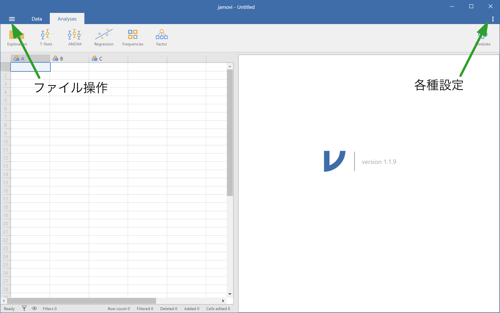
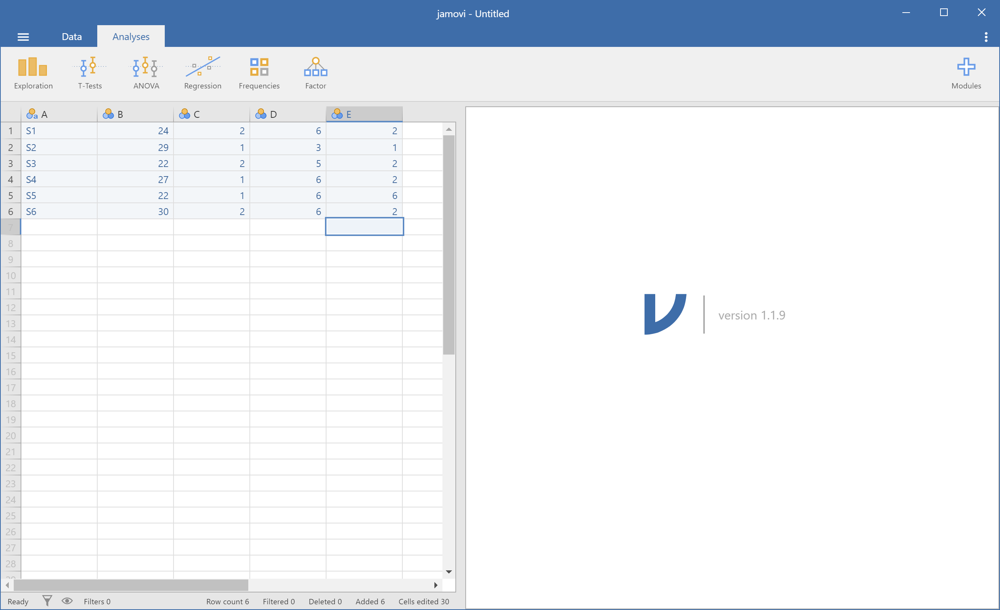

# jamovi のインストールと操作の基礎 {#install}

## jamovi のインストール

jamovi は，プロジェクトの Web サイト (https://www.jamovi.org/) からダウンロードできます。Web サイトのダウンロードをクリックすると，OS に応じた選択肢がトップに表示されるので，安定版 (solid) をダウンロードしましょう。図の場合は，Windows 用の 1.1.9 solid が最新の安定版となっています。

```{r fig.cap="Web site of jamovi"}
knitr::include_graphics("./img/01install/Install02.PNG")
```

ダウンロードが完了したら，ファイルのアイコン (下図は Windows の安定版 1.1.9 の場合) をダブルクリックしてインストールを開始しましょう。

```{r fig.cap="jamovi installer"}

```

インストールは，その他のアプリと同じようにウィザードによって進行し，特に難しいことはありません。

インストールが完了したら，ソフトウェアを起動してください。


## jamovi の基本操作

jamovi は Excel や SPSS と良く似たスプレッドシート形式の外観をもっています。また，トップレベルのメニューは，データの各種操作を行う Data と，分析を行う Analysis の2つであり，とてもシンプルです。ファイルの操作は，Data の左にある Ξ のような形をしたメニューをクリックして行います。また，設定は，画面右上にある三つの点が縦に並んだボタンをクリックして行います。

```{r fig.cap="Interface of jamovi"}

```

### データの入力

では，まずデータを入力してみましょう（表1）。使い方は，Excel や SPSS とよく似ていて，特に難しいことはありません。なお，A 列は被験者番号 (PID; S1-S6)，B 列は年齢 (Age)，C 列は性別（Gender; 1=男性, 2=女性），D 列は外向性の測定項目1 (Ex1)， E 列は外向性の測定項目2 (Ex2R, 逆転)となっています。

Table: 年齢と性別のデータ

| A    | B    | C    | D    | E    |
| ---- | ---- | ---- | ---- | ---- |
| S1   | 24   | 2    | 6    | 2    |
| S2   | 29   | 1    | 3    | 1    |
| S3   | 22   | 2    | 5    | 2    |
| S4   | 27   | 1    | 6    | 2    |
| S5   | 22   | 1    | 6    | 6    |
| S6   | 30   | 2    | 6    | 2    |

データを入力し終えると 下図のようになっているはずです。

```{r fig.cap="Data entry"}

```

次に，列（変数）の設定を行います。Data タブをクリックし，1列目 (A) のいずこかのセルが選択されている状態で Setup ボタンをクリックしましょう。すると，下図のような設定画面となるので，変数名 (Data variable) に PID を入力します。変数（データ）の種類としては，連続量 (Continuous)，順序尺度 (Ordinal)，名義尺度 (Nominal) の他に，jamovi に特有の変数種類として ID の4種類があります。なお，ID はデータの型としては名義尺度なのですが，変数の値をメモリ上に貯蔵しないので，メモリの消費を抑えることができます。

```{r fig.cap="Variable setup (ID)"}
knitr::include_graphics("./img/01install/Install08_var_setup.PNG")
```

それでは，A 列は変数名を PID (変数種別は ID)，B 列は変数名を Age (種別 Continuous)，C 列は変数名を Gender (種別 Nominal) としてみましょう。D，E 列はそれぞれ変数名を Ex1, Ex2R (種別 Continuious) とします。列間の移動は，設定画面左右にある <，> をクリックするとできます。なお，C 列の性別については，1 = Men, 2 = Women とするようにラベルを付けます。値ラベルは，Levels ボックスに入力してください。

```{r fig.cap="Variable setup (gender)"}
knitr::include_graphics("./img/01install/Install11_var_gender.PNG")
```

変数の設定が終わると，下図のようになるはずです。

```{r fig.cap="Finish data entry"}
knitr::include_graphics("./img/01install/Install14.PNG")
```

### 変数の計算

次に，変数の値を使った計算について説明します。D, E 列はそれぞれ，外向性を測定する質問項目であり，それぞれは 7 件法 (1-7) で評価されています (1 = 全く違うと思う, 7 = 強くそう思う)。しかし，E 列の Ex2R は逆転項目となっていて，1 になるほど外向的であるため，逆転項目の処理が必要です。逆転項目の処理は，一般に，

```
(件数+1) - 評価値
```

で行われます。jamovi では，変数の値を使った計算は，Data タブにある Compute をクリックして行います。自動的に F 列が選択され，変数名や計算式を入力する画面となりますので，変数名 (Computed Variable) を Ex2，計算式として，

```
8-Ex2R
```

と入力しましょう。

```{r fig.cap="Calculate reverse score"}
knitr::include_graphics("./img/01install/Install15_compute_rev.PNG")
```

さらに，2つの外向性項目の合計点を，G 列に，Extraversion という変数名で作成します。

```{r fig.cap="Calculate sum"}
knitr::include_graphics("./img/01install/Install16_compute_sum.PNG")
```

### ファイルの保存

ファイルの各種操作は，Data タブの左側にある Ξ のような形をしたボタンをクリックして行います。選ぶことができるのは，新規作成 (New)，データを開く (Open)，外部ファイルからのインポート (Import)，上書き保存 (Save)，名前を付けて保存 (Save as)，外部ファイルへのエクスポート (Export) の 6 通りです（メニューの下に，最近使用したファイルのリストが表示されます）。

それでは，ここまで作成したファイルを保存しよう。Save または Save as をクリックするとファイル名やフォルダを指定するダイアログが表示されますので，フォルダとファイル名に注意して保存しよう。ただし，Save は，初回のファイル名が設定されていない場合のみ，ダイアログが表示され，一度保存した状態で Save をクリックした場合は，そのファイルへの上書き保存となりますので注意してください。フォルダをデフォルトから変える場合は，Browse ボタンをクリックすると保存用のダイアログが表示されるので，目的のフォルダを選択し，ファイル名を入力してください。

```{r fig.cap="Save file"}
knitr::include_graphics("./img/01install/Install17.PNG")
```

### ファイルを開く

ファイルを開く場合は，Open をクリックし，開きたいファイルを選択します。保存の時と同様，フォルダを移動したい場合は，Browse ボタンをクリックします。ファイル形式としては，jamovi のデータ (*.omv) 以外にも，CSV や各種統計ソフトウェアのデータファイル (SPSS, R, Stata, SAS, JASP) を直接開くことができます。Excel には対応していませんが，Excel において CSV 形式で保存することによって，jamovi でも開くことができるようになります。

### インポートとエクスポート

エクスポートは，データを，jamovi の他，統計ソフトウェアのデータ (SPSS, R, Stata) あるいは，html，pdf 形式で出力することができます。

インポート → 後日加筆

### その他データの操作

#### 値の割り当て

ある変数の値を元に，別の変数に値を割り当てたい場合は，Data タブにある Transform を使います。例えば，年齢 (Age) を25歳以上 / 未満に分けたい場合は，Age のどこかが選択されている状態で Transform をクリックします。すると下図のように，Age(2) という名前で新たな変数が作成されるので，変数名と値の割り当て規則を設定します。

```{r fig.cap="Recode variable"}
knitr::include_graphics("./img/01install/Install18_transform.png")
```

ここでは，変数名を Age_grp とします。割り当て規則は，using transform のドロップダウンボックスをクリックし，新規作成 (Create New Transform) を選択して設定します。

```{r fig.cap="Recode setup"}
knitr::include_graphics("./img/01install/Install19_transform_age.png")
```

新規作成を選ぶと，割り当て規則の編集画面となるので，規則の名前と条件を入力しましょう。ここでは，条件規則について，25歳未満を1, それ以上は2とするようにコーディングしたいと思います。規則を編集する場合，Add recode condition をクリックします。デフォルトでは下図のように元の変数をそのまま使用するようになっているので，Add recode condition をクリックし，

```
if $source < 25 use 1
else use 2
```

となるように入力します。

```{r fig.cap="Recode rule"}
knitr::include_graphics("./img/01install/Install20_transform_rule.png")
```

上で説明した，変数の値を使った計算や，値の再割り当ては，任意の位置の列に挿入したり，データの末尾に挿入することもできます。その場合は，Variables グループの中にある Add をクリックし，Insert（挿入）または Append (末尾に追加) を，それぞれの操作ごとに行います。データ (行) を途中で挿入する場合は，Rows グループの中の Add をクリックし Insert を，行を末尾に追加したい場合は Add → Append を選択することで可能です。

#### フィルター（データの選択）

データの中から一部のみを選択したい場合は，Rows グループにある Filters を使います。試しに，男性のみを選択してみましょう。まず，Filters をクリックし，選択の条件に，

```
Gender == "Men"
```

と入力します。ここで，= が一つだけだと，代入を意味するため条件式としては正しくなく，== と2つ重ねることによって，Gender の値が Men と一致する場合，という意味になりますので注意してください。なお，条件式の下にある description フィールドは，フィルタにつける補足説明なので，あってもなくても動作自体に影響はありません。

```{r fig.cap="Apply filter"}
knitr::include_graphics("./img/01install/Install21_filter_active.png")
```

適用したフィルタを解除する場合は，フィルタ変数そのものを削除するか，フィルタ変数の設定 (setup) で，inactive にしてください。

```{r fig.cap="(De)activate filter"}
knitr::include_graphics("./img/01install/Install22_filter_inactive.png")
```