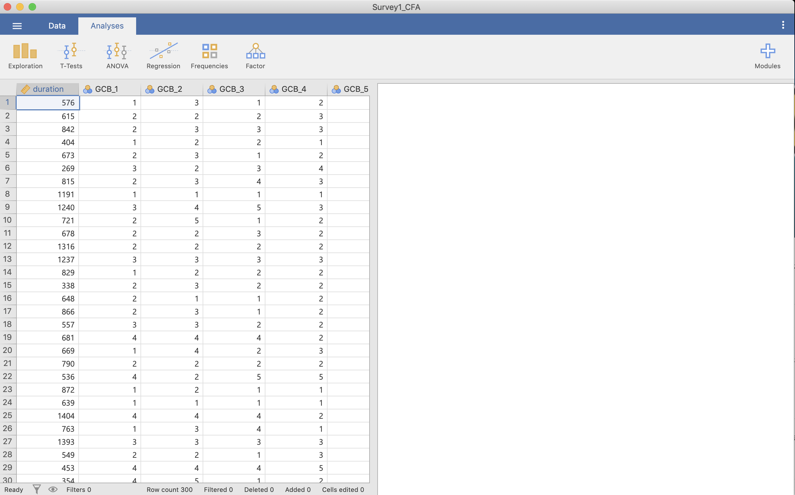
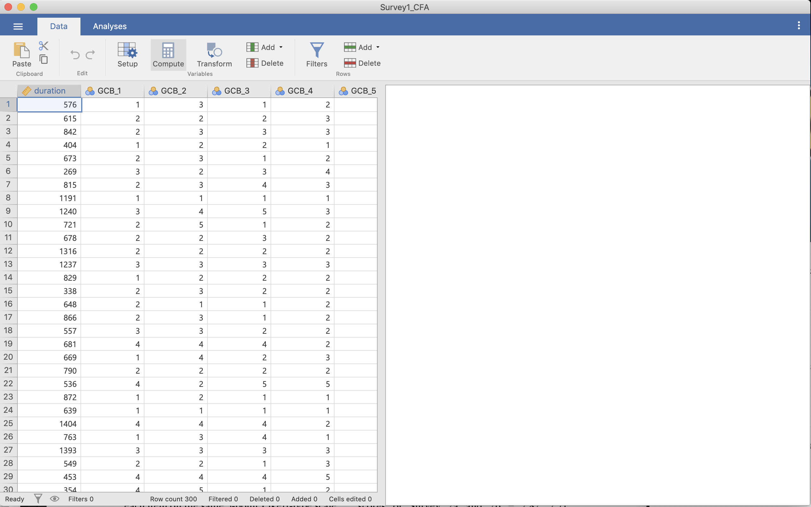
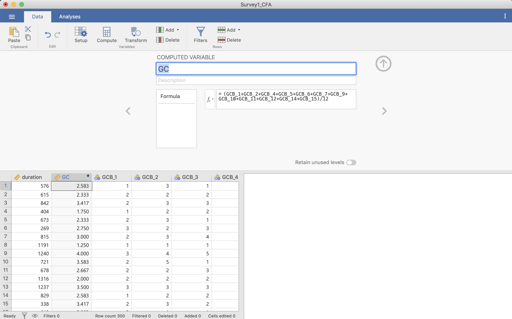
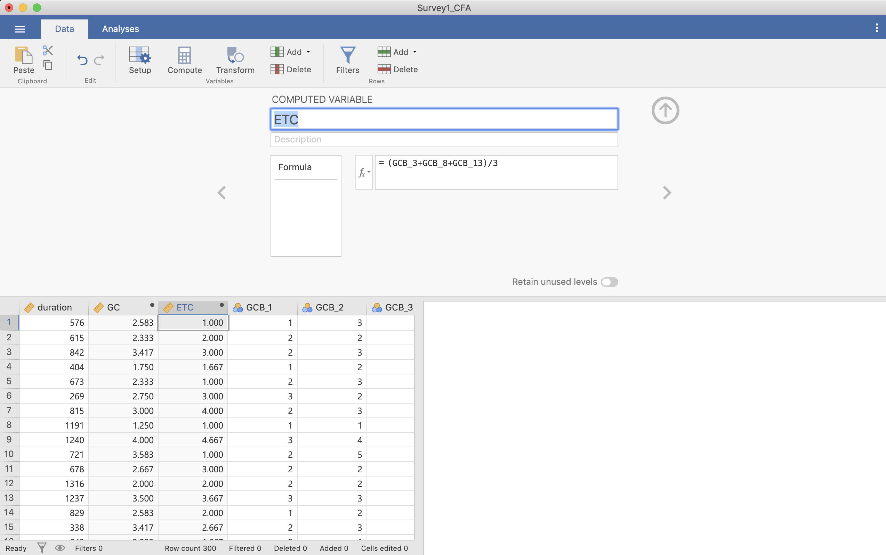
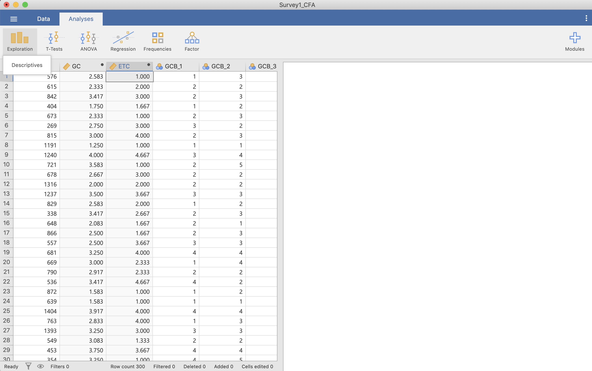
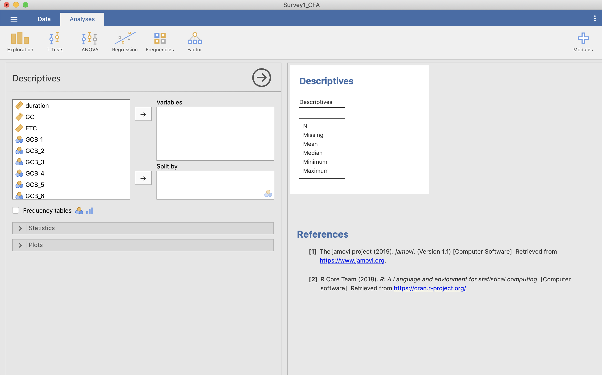

# 記述統計 {#descriptives}

本節では記述統計量の操作方法を解説します。計量データを分析するときにはいきなり統計を始めず，まずはそのデータの大まかな傾向を掴む必要があります。そのために見るのが記述統計量と呼ばれるものです（要約統計量，基本統計量，代表値などとも）。記述統計量の代表的なものとしては平均値と分散があるので，ここではjamoviを使ってその計算方法を説明します。

## 平均化する
ここではMajima & Nakamura (2019)のStudy 1のデータを使います。Majima & Nakamura (2019)ではGCBS(一般陰謀論者信念尺度, Generic Conspiracist Beliefs Scale)，BCTI(陰謀理論目録の信念,  Belief in Conspiracy Theories Inventory)，OICM(【日本語】,One-Item Conspiracy Measure)の記述統計量を出していますが，ここではGCBSのうち，EFA (exploratory factor analysis) subsampleのみ扱います。GCB-Jは一般陰謀論者信念尺度と呼ばれ，GCは一般陰謀者信念とETC(地球外陰謀論者信念)という2つの下位尺度からなります。この2つの下位尺度の記述統計量を出すためにはそれぞれの尺度の平均値を出す必要があります。

CSVファイル(Survey1_EFA.csv)を読み込みます。

列を見るとGCB_1からGCB_15まであることが分かります。GCとETCを出すのに必要な変数は次のように分かれています。

* GC (12項目)
  * GCB_1, GCB_2, GCB_4, GCB_5, GCB_6, GCB_7, GCB_9, GCB_10, GCB_11, GCB_12, GCB_14, GCB_15
* ETC (3項目)
  * GCB_3, GCB_8, GCB_13

それぞれの下位尺度の記述統計量を出すにあたり，このデータをそれぞれ平均化する必要があります。平均化は次の手順で行います。まずDataタブを選択します。

この状態で[Compute]を押します。この状態で新しい変数が追加されていますので，COMPUTED VARIABLE（おそらく「B」と書かれている）に新たな変数の名前を付けます（ここではGCにします）。

そして，2行下の=の後ろに計算式を入れます。ここでは必要な変数を全て足し，項目数の12で割ります。そうすると平均した結果が出てきます（1行目の2.583など）。

ETCについても出す必要があるので，再び[Compute]を押して，変数の名前(ETC)を入れ3つの変数を足し，3で割ります。

## 記述統計量の計算

記述統計量を出すためにAnalysisタブを押し，[Exploration]から[Descriptives]を選択します。

そうすると記述統計量のための画面になります。

ここでここで先ほど計算したGCとETCを選択し「→」を押すと，右の画面にデフォルトの記述統計量が出てきます。

Statisticsを押すと様々な項目があるので，必要な記述統計量の項目を選びます。ここではMajima & Nakamura (2019)に従い「平均 (Mean)」と「標準偏差 (Std. deviation)」を選択してみましょう。

このようにして記述統計量として平均と標準偏差を出すことができました。