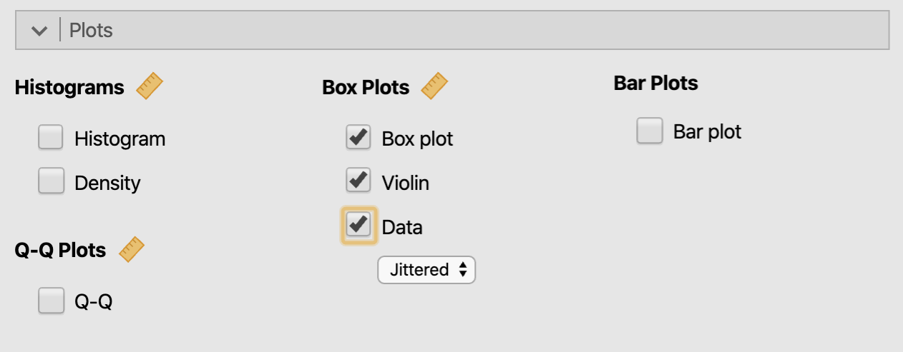
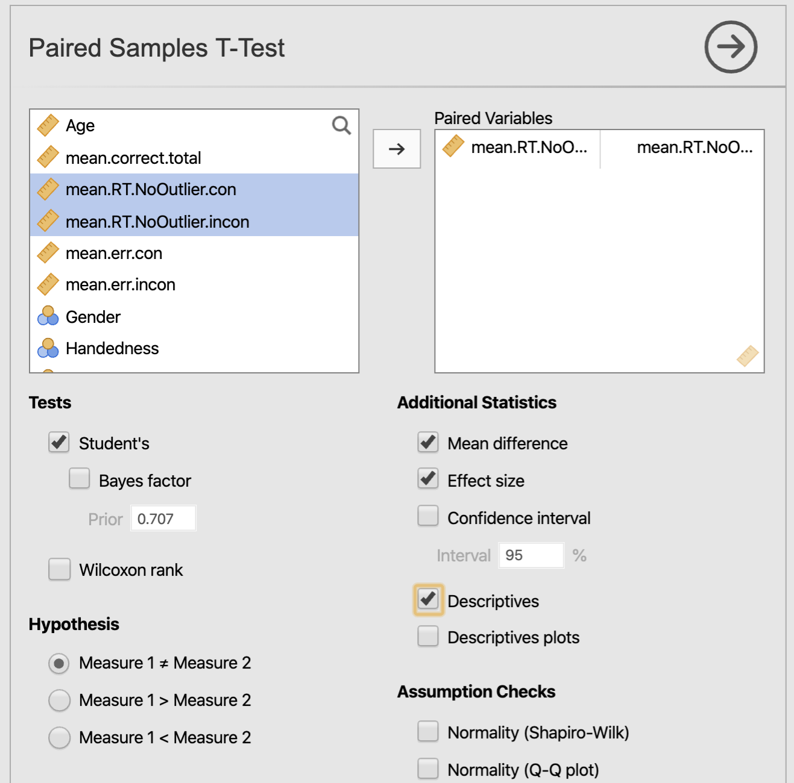

# 平均値の検定 {#means}

## 対応のないt検定

本項ではt検定の分析方法を解説します。ここでは永井(2018)によるデータを使い，居場所尺度の下位尺度である「社会的居場所」の平均得点が男性と女性で異なるのかどうかを分析していきます。t検定は，データの正規性や仮説の立て方によって適切な分析方法を選択していく必要があります。ここでは，男性と女性という異なる２つの標本を用い，Jamoviniを使った独立した標本による対応のないｔ検定の分析方法を解説します。

対応のないt検定を実施する場合，等分散性が仮定されているかどうかによってt値の計算方法が変わるため，前提条件として２標本の分散が同じか否かの判定が必要となります。Jamoviの場合，t検定を分析する際のオプションとしてこの検定を実施することができます。そこで，本稿ではスチューデントのt検定と等分散性の検定を同時に実施し，等分散が確認できればそのままt検定の結果を採用し，等分散性が確認できなければ等分散性を仮定しないウェルチのt検定に切り替えて分析する方法を紹介します。

また，t検定の場合，仮説の立て方によって棄却域が変わります。ここで想定可能な仮説は，１）男性の方が「社会的居場所」得点が高い可能性，２）逆に女性の方が高い可能性，３）男女間で何らかの相違がある可能性の３つです。前者の１）と２）とでは，理論的にまったく異なる結果であることが分かります。どの仮説を採用するかは，先行知見と照らし合わせながら適切な根拠を示すことができる仮説を採用します。今回は，研究内容には踏み込まずに，操作方法を重点的に説明するため，３）の男女間で相違があるか否かを調べる両側検定を行っていきます。

では，この概要を踏まえて，基本統計量の算出とt検定の実施を行っていきましょう。

### 基本統計量の算出

まず，適切な分析方法を選ぶための準備として，男女のサンプル数，平均値，標準偏差，ヒストグラム，密度曲線を見ていきます。t検定の理解を深めるために必要な手順ですが，手早く分析したい場合にはこの基本統計量の算出は飛ばすこともできます。その場合には，後述するt検定の分析の際にAdditional Statisticsカテゴリー内にあるDescriptivesを追加します。

Jamoviで基本統計量を算出する場合，「Analyses（分析）」タブより「Exploration（記述統計）」を選択し，さらに「Descriptives（基本統計量）」を選択します。変数リストより→のボタンを押して，［Variables（変数）］に「社会的居場所」を，［Split by（グループ変数）］に「性別」を指定します。

```{r fig.cap="記述統計量の計算"}
knitr::include_graphics("./img/03mean/exploration_01.png")
```

次に［Statistics］より，オプション設定を１つ行います。Dispersion（ばらつき）カテゴリーにあるStd. deviation（標準偏差）にチェックを追加します。

```{r fig.cap="統計量の選択メニュー"}
knitr::include_graphics("./img/03mean/exploration_02.png")
```

次に，算出結果を見ていきます。性別の符号は，１＝男性，２＝女性になります。サンプル数をみると，男性が122名，女性235名であることが分かります。「社会的居場所」得点の平均値は，男性が2.98，女性が3.13と女性の方が0.15高いことが分かります。なおこの２つの平均値に有意な差があるのかどうかは，t検定の結果を見て判断しましょう。また，分布のばらつきを調べる標準偏差は，男性が0.642，女性が0.559と男性の方が0.08数値が大きくなっています。このばらつきが同じかどうかについてはt検定の計算方法を決める際に必要となります。等分散性の検定でさらに判断していきましょう。また，平均やばらつきなどの分布の特徴は，数値だけでなく，全体を視覚的に捉えることも大切です。以下のPlotsにある作図オプションも見ていきましょう。

```{r fig.cap="記述統計量の計算結果"}
knitr::include_graphics("./img/03mean/exploration_03.png")
```

Jamoviによる作図は非常に簡便です。［Plots］よりHistograms（ヒストグラム）カテゴリーにあるHistogram（ヒストグラム）と（密度曲線）にチェックするだけで作図が行われます。

```{r fig.cap="作図メニュー"}
knitr::include_graphics("./img/03mean/exploration_04.png")
```

```{r fig.cap="ヒストグラムと密度曲線"}
knitr::include_graphics("./img/03mean/exploration_05.png")
```

　凸凹しているのがヒストグラム，曲線がヒストグラムをカーネル平滑化した密度曲線になります。Jamoviでは，ヒストグラムに密度曲線を重ねて作図することができます。その他に，Box Plot（ボックスプロット）では，データの中央値・四分位範囲・範囲をシンプルな形で視覚化する箱ひげ図が，Q-Q（Q-Qプロット）では，標本が正規性の仮定を満たしているかどうかを視覚的に確認することができます。

### t検定の実施

では，上記の基本統計量の結果を理解した上で，t検定を実施していきます。まず「Analyses」タブより「T-Tests」を選択すると３つの分析タイプが出てきます。各分析タイプの概略を以下に記します。

#### t検定の種類

**Independent Samples T-Test（独立標本のｔ検定）**

男性のデータと女性のデータのように，対応のない２つの標本の平均値の差を求めたいときに用います。Jamoviでは，スチューデントの対応なしｔ検定，ウェルチ検定，マン・ホイットニーのＵ検定の３つを行うことができます。

**Pared Sample T-Test（対応のある標本のｔ検定）**

同じ人で走る前のデータと後のデータように，対応のある２つの標本の平均値の差を求めたいときに用います。Jamoviでは，スチューデントの対応ありｔ検定，ウィルコクソンの符号順位検定の２つを行うことができます。

**One Sample T-Test（１標本のｔ検定）**

10人の身長の平均と日本人の平均身長のように，１組のデータとある固定値を比較したいときに用います。Jamoviでは，スチューデントの対応ありｔ検定，ウィルコクソンの符号順位検定の２つを行うことができます。

```{r fig.cap="独立な2群の t 検定メニュー"}
knitr::include_graphics("./img/03mean/t-test_00.png")
```

ここでは，男性と女性という異なるサンプルデータを分析するため，Independent Samples T-Test（独立標本t検定）を選択します。続いて，選択した画面の変数リストより→のボタンを押して，Dependent Variables（従属変数）に「社会的居場所」を，Grouping Variable（グループ変数）に「性別」のグループ変数を指定します。

```{r fig.cap="変数の選択"}
knitr::include_graphics("./img/03mean/t-test_01.png")
```

次に，以下の分析方法を確認もしくは追加していきます。

#### Tests（検定方法）

**Student’s（スチューデント検定）**：分散の等質性を仮定したスチューデントのｔによる検定を行います。さらにオプションであるBayes factor（ベイズ因子）では，平均値の差に関するベイズ因子を算出します。
**Welch’s（ウェルチ検定）**：分散が等質であるという仮定を設けないウェルチ法によるｔ検定を行います。
**Mann-Whitney U（マン・ホイットニーのＵ）**：分布の正規性が確認できない場合に行います（ノンパラメトリック検定）。男性と女性の各分布の正規性を調べるには，基本手統計量のところでQ-Qプロットやシャピロ・ウィルク検定にチェックを入れて確認することができます。t検定のオプションでもQ-Qプロットの作図やシャピロ・ウィルク検定を実施することができますが，男性と女性をまとめたデータ全体の分布に対する評価が行われます。２標本それぞれの分布の正規性を確認したい場合には，基本統計量のところで確認すると良いでしょう。これら正規性の検定は必要に応じて実施し，分布の正規性が確認できなければノンパラメトリック検定を実施します。

ここでは，ひとまずスチューデントのt検定が選択されているのを確認しましょう。

#### Hypothesis（仮説）

**Group 1 ≠ Group 2**：『グループ１と２の平均値に差があるかどうか』を調べる両側検定を行います。ここでは，男性（＝１）と女性（＝２）の得点に違いがあるかどうかを調べることになります。
**Group 1 > Group 2**：『グループ１の平均値がグループ２の平均値より有意に高いかどうか』を調べる片側検定を行います。ここでは，男性（＝１）の方が女性（＝２）より平均値が高いかどうかを調べることになります。
**Group 1 < Group 2**：『グループ２の平均値がグループ１の平均値より有意に高いかどうか』を調べる片側検定を行います。ここでは，女性（＝２）の方が男性（＝１）よりも平均値が高いかどうかを調べることになります。

ここでは，両側検定を行うので，Group 1 ≠ Group 2が選択されているのを確認しましょう。

#### Missing values（欠損値）　

**Exclude cases analysis by analysis**：欠損値がある場合，各分析ごとに該当する行を除外します。
**Exclude cases listwise**：欠損値が含まれている行全体を分析から除外します。

ここでは，Exclude cases analysis by analysisが選択されていることを確認しましょう。

#### Additional Statistics（その他の統計量）

**Mean difference（平均値の差）**：平均値の差と差の標準誤差を算出します。
**Effect size（効果量）**：Cohen's d（コーエンのｄ）を算出します。
**Confidence intervals**（信頼区間）：指定した幅の信頼区間を算出します。
**Descriptives（記述統計量）**：N（標本サイズ），Mean（平均値），Median（中央値），SD（標準偏差），SE（標準誤差）を算出します。
**Descriptives plots（記述統計量プロット）**：Mean(95%CI)（平均値（95%信頼区間），Median（中央値）のグラフを作成します。

ここでは，Descriptivesにチェックを入れましょう。すでに基本統計量の算出のところで確認した数値ですので，出力結果についての解説は省きますが，基本統計量の算出をなるべく簡素化したい場合にはこのDescriptivesで確認すると良いです。

#### Assumption Checks（分析に関わる前提条件の確認）

**Normality (Shapiro-Wilk)（シャピロ・ウィルク検定）**：データ全体のWとp値が算出されます。データが正規分布から乖離していないかどうかを確認します。この検定の帰無仮説は「データに正規性がある」なので，p値が0.05以下の場合には『データに正規性がない』ことになります。
**Normality (Q-Q plot)**：データが正規分布しているかどうかを視覚的に確かめるためのＱ‐Ｑプロットを作図します。
**Equality of variances（分散の等質性）**：分散が等質であるかどうかを調べるために，Levene（ルビーン）の等分散性検定を実施します。今回紹介している独立標本のｔ検定にのみ必須の前提条件となります。対応のある標本のｔ検定および１標本のｔ検定に，このオプションはありません。

ここでは，Equality of variances（分散の等質性）にチェックを入れます。はじめに述べたように，Jamoviで独立標本のｔ検定を行う場合，ここで等分散性の検定を行うことができます。そのため，t検定と等分散性の検定結果は同時に出力されます。この等分散性の検定結果によって，等分散性が仮定されない場合にはスチューデントのt検定からウェルチのt検定に変更する必要があります。

```{r fig.cap="分散の等質性の検定の実行"}
knitr::include_graphics("./img/03mean/t-test_02.png")
```

### 結果の見方

#### 等分散性の検定結果

結果は，t検定の結果ではなく，検定の前提条件となるAssumptionsにあるTest of Equality of Variances(Levene's)の結果から見ていきます。

```{r fig.cap="等質性の検定の結果"}
knitr::include_graphics("./img/03mean/t-test_03.png")
```

等分散性の検定の場合，p < 0.05 であった場合は『分散に差がある』，p ≧ 0.05 であった場合は『分散に差がない』となります。今回のp値は0.182なので『分散に差がない』つまり等分散性を仮定したスチューデントのt検定が適切な検定となります。今回はこのスチューデントのt検定を選択していたので，そのままt検定の結果を見ていきます。『分散に差がある』場合には，TestsカテゴリーにあるWelch's（ウェルチのt検定）にチェックを入れます。

#### t検定の結果

では，スチューデントのt検定の結果を見てみましょう。

```{r fig.cap="t 検定の結果"}
knitr::include_graphics("./img/03mean/t-test_04.png")
```

ｔ値は2.24，ｐ値は0.026と有意な差が見られています。したがって，男性と女性は「社会的居場所」において異なる（t(355)=2.24, p < .05)ことが分かりました。

では，さいごにもう一つt検定を行ってみましょう。基本統計量のところで確認したように「社会的居場所」の平均値は，女性の方が男性よりもが高い結果が得られていました。もし理論的に女性の方が「社会的居場所」得点が高くなる可能性を説明できるのであれば，統計的にも女性の方が得点が高いことを示した方が説得力が高まります。そこで，ここでは理論的根拠を説明できることを仮に想定した場合，女性の方が「社会的居場所」得点が高くなるのかどうかを調べる片側t検定の結果がどうなるのか試してみます。

分析は先ほどとすべて同じですが，次の１カ所のみ変更します。Hypothesis（仮説）をGroup 1 < Group 2に変更します。

```{r fig.cap="片側検定への変更"}
knitr::include_graphics("./img/03mean/t-test_05.png")
```

```{r fig.cap="片側検定の実施"}
knitr::include_graphics("./img/03mean/t-test_06.png")
```

両側検定と同じく有意になりました。この場合，変更されたのはp値の0.013のみで，t値，自由度はそのままの値です。分布の両側を棄却域にするよりも，片側を棄却域にする方が若干検出力が高くなります。この結果からは，女性の方が男性よりも「社会的居場所」得点が有意に高い（t(355)=2.24, p < .05)ことを示すことができます。このように両側と片側検定は仮説に応じて使い分けていきます。

## 対応のある t 検定

次に，同一の標本から複数回測定値を得た場合に行われる対応のある2群の t 検定について説明します。ここでは，Majima (2017) のデータを使い，フランカー課題において，中央のターゲット刺激と周辺刺激が一致している場合 (con) と，一致しない場合 (incon) とで，反応時間が異なるかどうかを分析していきます。
なお，Majima (2017) では，試行の種類（一致・不一致）と，参加者の種別（学生・クラウドワーカー）を組み合わせた分析をしていますが，ここでは試行の種類のみに注目した比較を行うことにします。
まずは，対応のない場合と同じように，基本統計量の算出から行っていきましょう。

### 基本統計量の算出

算出の手順は，対応のない場合と全く一緒なのですが，Majima (2017) では，全体の正答率が 0.8 以下である参加者を分析の対象外としています。
ここでも，その手続きに従ってデータのフィルタリングを行います。
フィルタリングの詳細は，第2章の 2.2 [jamovi の基本操作](https://yoshi-mjm.github.io/stat_jamovi/ch01-install-jamovi.html#jamovi-%E3%81%AE%E5%9F%BA%E6%9C%AC%E6%93%8D%E4%BD%9C) を見てください。

このデータで，全体の正答率は，mean.correct.total という変数にありますので，この変数の値が 0.8 より大きいものを選びます。

```{r fig.cap="参加者の選択"}
knitr::include_graphics("./img/03mean/pairwise-filter.png")
```

では，つづいて記述統計量を計算します。
今回対象となる変数は，一致試行の反応時間 (mean.RT.NoOutlier.con) および，不一致試行の反応時間 (mean.RT.NoOutlier.incon) の2つです。なお，この変数では，早すぎる反応と遅すぎる反応 (平均+3SD 以上) を除外することで，反応時間の分布の歪みに対処しています。つまり，外れ値 (Outlier) を除いているわけです（詳細は元論文を見て下さい）。

```{r fig.cap="変数の選択"}
knitr::include_graphics("./img/03mean/pairwise-descriptive_01.png")
```

また，対応のない t 検定の時に，データの可視化の方法としてヒストグラムを使いましたが，ここではもう一つの方法を使って見ましょう。それが，箱ひげ図 (Box plot) とバイオリン図 (Violin plot) です。
箱ひげ図は，中央値を中心に，四分位点や外れ値の存在を可視化してくれる図です。しかし，これだけでは分布の形状が今ひとつよくわからないため，近年では，箱ひげ図に加えて，カーネル密度推定をプロットしたバイオリン図が使われるようになってきています。

箱ひげ図，バイオリン図は，ヒストグラムと同様に， 作図 (Plots) メニューの中にあります。作図したい図にチェックを付けてください。また，バイオリン図の下にある Data というチェックは，この図に実際のデータを合わせてプロットするオプションです。ただ，同じ値が重複していると点が同じポイントに来てしまうので，少しずらして表示する (jitter) ことにします。

```{r fig.cap="箱ひげ図とバイオリン図のオプション"}

```

今回のデータについて，箱ひげ + バイオリン図にデータを重ねると，以下のようなグラフになります。

```{r fig.cap="箱ひげ図とバイオリン図"}
knitr::include_graphics("./img/03mean/pairwise-descriptive_03.png")
```

中心は 500 ms  付近にありますが，最大が 1200ms  以上となるなど，正方向にやや歪んだ分布であることがわかります（これは，反応時間の特徴的な分布です）。

### 対応のある t 検定の実施

では，続けて対応のある t 検定を行います。
上の 4.1.2 にあるように，jamovi の t 検定には 3 種類のものがありますが，ここでは対応のある標本の t 検定 (Paired Samples T-Test) を選びます。

```{r fig.cap="対応のある t 検定"}
knitr::include_graphics("./img/03mean/pairwise-t-test_00.png")
```

対応のない t 検定と違い，対応のある t 検定は，原則として 1 人につき，2つの測定値が対になって存在します。そのため，対応のある t 検定では，そのペアを指定する必要があります。
対になった変数は，Paired Variables のボックスに2つ並べて入れてやります（変数を2つ選択して，矢印ボタンをクリックすれば良いです）。

```{r fig.cap="変数の選択"}
knitr::include_graphics("./img/03mean/pairwise-t-test_01.png")
```

そして必要な統計量を選択します。例では，Student.の t，平均の差，効果量 (Cohen's d)，各変数の記述統計量が選択されています。

```{r fig.cap="出力する統計量のの選択"}

```

この検定を行うと，結果は，以下のようになります。

```{r fig.cap="対応のある t 検定の結果"}
knitr::include_graphics("./img/03mean/pairwise-t-test_03.png")
```

結果から，$t(198) = 11.7, p < .001, Cohen's \; d = 0.83$，つまり一致試行と不一致試行で反応時間に有意な差が見られることがわかります。なお，ここで $t < 0, d < 0$ となっているのは，ペアにした2つ目の変数，すなわち不一致試行の方が，1つ目の変数である一致試行よりも反応時間が長いためです (618 ms. vs. 577ms)。
しかし，両側検定で検定の対象となっている帰無仮説は，両群の平均値は等しい，というものですので，t の値は正負どちらでも良いということになります。

