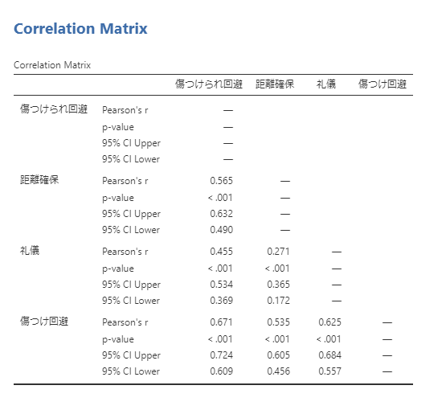
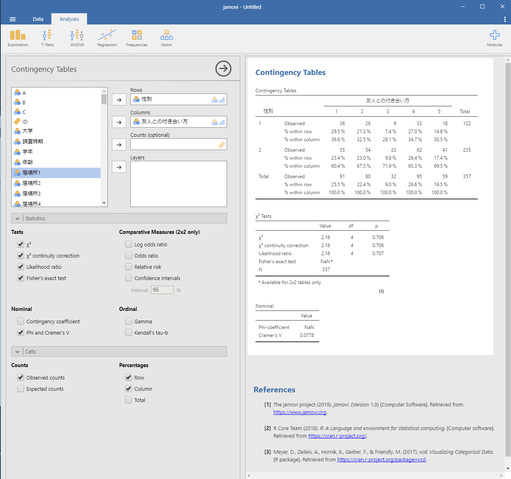

# 相関と連関 {#correlation}
　本節では回帰分析および重回帰分析の操作方法を解説します。ここでは永井(2018)が扱ったデータ (Nagai_2018.csv) を使って分析していきます。永井(2018)では，「傷つけ合い回避」尺度と「ソーシャルスキル」尺度を用い，友人との付き合い方を分類しています。ここで用いられている「傷つけ合い回避」尺度は「傷つけられ回避」，「距離確保」，「礼儀」，「傷つけ回避」の４つの下位尺度から構成されています。それでは，この４つの下位尺度間にはどの程度関連性があるのか確かめます。この時，それぞれの調査協力者が示す各下位尺度の得点は，各下位尺度に含まれる複数の質問項目に対して５件法で回答した結果の平均値として求められています。このような情報は間隔尺度として扱えるため，４つの下位尺度間の関連性は相関係数を求めることによって確かることができます。
　調査に協力した357名の学生の「友人との付き合い方」は，「傷つけ合い回避」尺度と「ソーシャルスキル」尺度への回答結果に基づいて5つのグループ（クラスタ）に分けられ，永井(2018)ではそれぞれのグループが示した特徴が述べられます。本節では，5つに分けられたそれぞれの「友人との付き合い方」のグループと，調査協力者の性別との関わりについて検討した結果（Table 2）についても確かめてみましょう。
　

## 相関係数を求める／相関分析をおこなう 
　まず，「傷つけ合い回避」尺度の下位尺度である「傷つけられ回避(avo_hurt)」，「距離確保(distance)」，「礼儀(courtesy)」，「傷つけ回避(avo_blacken)」のそれぞれの尺度得点間の関連性を確かめてみましょう。まず，AnalysesタブのRegressionを選択します。プルダウンメニューから「Correlation Matrix」を選択してください (Figure 4-1)。ここまでの分析と同様に，左側のボックスには変数の一覧が表示されています。この変数の一覧から使用する変数を選び右側のボックスに移します。ここでは「傷つけられ回避」，「距離確保」，「礼儀」，「傷つけ回避」のそれぞれの尺度得点間の関連性を確かめるため，「傷つけられ回避」，「距離確保」，「礼儀」，「傷つけ回避」の４つを選びます。すると右側の出力結果部分に，それぞれの尺度得点間のピアソンの積率相関係数 (Pearson's r) を示した相関行列が示されます。

Figure 4-1 相関行列の表示  

　ピアソンの積率相関係数 (Pearson's r) の下の行に示されている数値は，その相関係数が生じ得る確率 (p-value)です。「その相関係数が生じ得る確率 (p-value)」とは，関連性を確認した２つの変数から得られた相関係数について，仮説検定（無相関検定）を行った結果を示しています。無相関検定の帰無仮説は「相関がない／相関係数≒０」となります。相関係数は自由度がn-2のt分布に従うことが知られているので， $$ t = r\sqrt{n-2}/\sqrt{1-r^2} $$ の式に，相関係数 (*r*) およびデータ数 (*n*) を代入してt値を求めると，そのt値が取る累積確率（外側）を用いて仮説検定を行えます。

### 信頼区間を表示する 
　左側のボックスの下部には「Correlation Coefficients」，「Additional Options」，「Hypothesis」，「Plot」の４つのメニューがあります。このうち「Additional Options」の「Confidence intervals」を選択すると，得られたピアソンの積率相関係数 (Pearson's r) が取り得る信頼区間が示されます(Figure 4-2)。このとき，信頼区間の水準を指定することができます（初期値の信頼区間の水準は95%）。示された数値は，母集団の相関係数が95％の確率で含まれる相関係数の範囲 (95% CI Lower ~ 95% CI Upper) を示しています。
　
 
Figure 4-2 相関行列の表示（信頼区間を示したもの）  

### 相関係数の結果を確かめる 
　Figure ％2で示された相関行列から，「傷つけられ回避」と「距離確保」との間には有意な正の相関が認められ (*r* = .57, *p* < .001, 95% *CI* [.49 .63])，「傷つけられ回避」と「礼儀」，そして「傷つけ回避」との間にもそれぞれ有意な正の相関が認められています (*r* = .46, *p* < .001, 95% *CI* [.37 .53], *r* = .67, *p* < .001, 95% *CI* [.37 .53], ) 。したがって，「傷つけられ回避」と「距離確保」，「礼儀」，「傷つけ回避」との間には中程度の関連性があることが分かります。同様に，「距離確保」と「礼儀」そして「傷つけ回避」との間にはそれぞれ有意な正の相関が認められています (*r* = .27, *p* < .001, 95% *CI* [.17 .37], *r* = .54, *p* < .001, 95% *CI* [.46 .61]) 。したがって「距離確保」と「礼儀」との間には弱い関連性が，「距離確保」と「傷つけ回避」との間には中程度の関連性があることが分かります。 最後に「礼儀」と「傷つけ回避」との間にも有意な正の相関が認められ (*r* = .63, *p* < .001, 95% *CI* [.56 .68]) ，この両者にも中程度の関連性があることが分かります。

　以上の結果から，「傷つけ合い回避」尺度の下位尺度である「傷つけられ回避」，「距離確保」，「礼儀」，「傷つけ回避」のそれぞれ４つの尺度は，互いに強く関連していることが明らかになりました。

## クロス集計／カイ二乗検定をおこなう 

　永井(2018)では，調査に協力した357名の学生の「友人との付き合い方」を，「傷つけ合い回避」尺度と「ソーシャルスキル」尺度への回答結果に基づいて５つのグループ（クラスタ）に分け，調査協力者の性別との関わりについて検討しています（Table 2）。この分析をどのようにおこなうのか，jamoviを操作して実際に確かめてみましょう。まず，AnalysesタブのFrequenciesを選択します。プルダウンメニューから「Contingency Tables」の下にある「Independent Samples *χ*2 test of association」を選択してください (Figure 4-3)。ここまでの分析と同様に，左側のボックスには変数の一覧が表示されています。この変数の一覧から使用する変数を選び右側のボックスに移します。ここではRows（行）に「性別(gender)」，Columns（列）に「友人との付き合い方(style_friendship)」を選択します。すると右側の出力結果部分に，連関表（クロス集計表）が示されます。同時にカイ二乗検定をおこなった結果も示されています。
　
 
Figure 4-3 性別と友人との付き合い方とのクロス集計表 

　それぞれのグループでの男女比を示したい場合には，左側のボックスの下部の「Cells」をクリックして開き，「Percentages」で Row と Column を選択すると，各性別での各グループの構成比および各グループでの男女比がクロス集計表に追加されて示されます (Figure 4-4)。これらの情報を見ると，男性でも女性でも各グループの構成比は変わらないこと，そしてどのグループでも男女比が３:７～４：６の間に収まっていることが分かります。
　
 
Figure 4-4 性別と友人との付き合い方とのクロス集計表（男女比を示したもの）

### カイ二乗検定の結果を確かめる
　Figure 4-４ で見たように，どちらの性別でも「友人との付き合い方」で分けた５つのグループの構成比に違いはありませんでした。またどのグループでも男女比は３:７～４：６の間に収まりました。このことは，５つの「友人との付き合い方」と調査協力者の性別との間に関わりはなく，「友人との付き合い方」は性別によって決まるものではない，と考えられます。この傾向はカイ二乗検定の結果 (*χ*2(4) = 2.16, *p* = .71) からも確かめられます。この結果に加えて，このカイ二乗値にどれだけ効果が認められるか確かめておきましょう。左側のボックスの下部の「Statistics」をクリックして開き，「Nominal」欄の 「Phi and Cramer's V」 を選択すると効果量が求められます (Figure 4-5)。今回の分析で用いた２行×５列のような多くのカテゴリーから構成される情報を分析する場合は，Cramer's V を用います。それぞれの２つずつのカテゴリーから構成される２行×２列のクロス集計の場合には，Phi-coefficient (*φ*) を用います。それぞれの降下量の目安は，小：.10，中：.30，大：.50です。今回の場合 *V* = .08ですので，「友人との付き合い方」と調査協力者の性別との間に連関がないこと（独立であること）が確かめられます。
　
 
Figure 4-5 性別と友人との付き合い方とのクロス集計表（男女比・効果量を示したもの）
　
　カイ二乗検定に用いられるカイ二乗値には，複数の求め方があります。一般的な求め方の他に尤度比と呼ばれるものを用いてカイ二乗値を求めたい場合には，左側のボックスの下部の「Tests」欄のLikelihood ratioを選択すると尤度比検定を行った結果が示されます (Figure 4-6)。また，今回の分析で用いた２行×５列のような，多くのカテゴリーからなる情報を分析する場合には問題になりませんが，それぞれが２つずつのカテゴリーからなる２行×２列である情報をクロス集計する場合には注意が必要です。２行×２列のクロス集計の場合は，「Statistics」をクリックして開き，「Tests」欄の*χ*2 continuity correction（連続修正／イエーツの修正），そしてFisher's exact test（フィッシャーの正確確率検定）を選択します。もし１つのセルの期待度数が５未満となる場合にはFisher's exact test の結果を用います。そうでない場合は，*χ*2 continuity correction の結果を用います (Figure 4-6)。

 
Figure 4-6 性別と友人との付き合い方とのクロス集計表（全ての情報を示したもの）
　　
　以上の結果をまとめると，「友人との付き合い方」によって分けた５つのグループと調査協力者の性別との間には関わり（連関）はなく独立の関係であること (*χ*2(4) = 2.16, *p* = .71, *V* = .08) が確かめられた，ということになります。