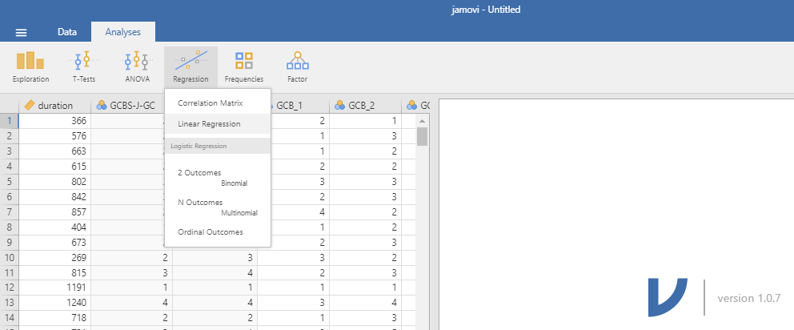
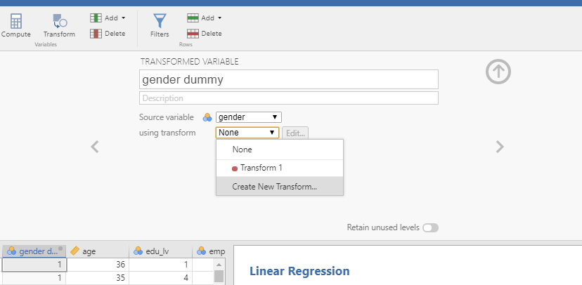
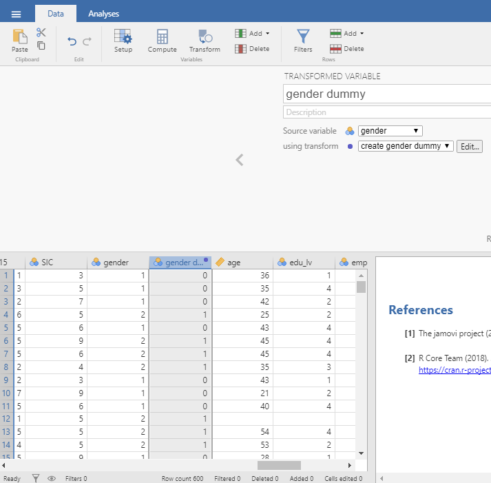
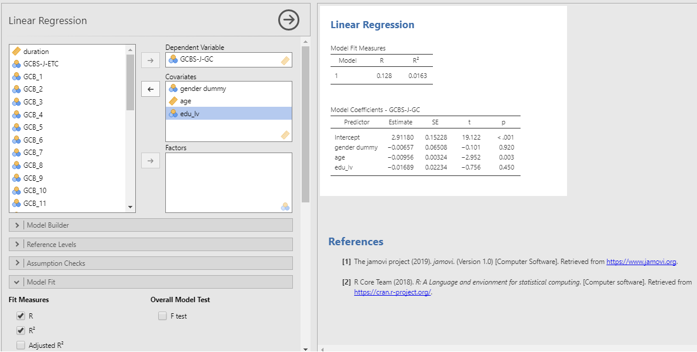

# 回帰分析・重回帰分析 {#regression}
  
　本項では回帰分析および重回帰分析の操作方法を解説します。ここではMajima & Nakamura(2019)のデータを使って分析していきます。  

## 回帰分析を行う 
　まず，AnalysesタブのRegressionを選択します。プルダウンメニューから「Liner Regression」を選択してください(Figure 6-1)。ここまでの分析と同様に，左側のボックスには変数の一覧が表示されています。この変数の一覧から使用する変数を選び，右側のボックスに移します。Dependent Variableに分析の従属変数(目的変数)を指定します。Covariatesに独立変数(説明変数)を指定します。たとえば，第2節で記述統計量を算出したMajima & Nakamura(2019)の，GCBS-J-GCをDependent Variableに，edu_lvをCovariatesに指定することで単回帰分析ができます(Figure 6-2)。重回帰分析を行う場合にはCovariatesに複数の独立変数を指定してください。  

```{r fig.cap="回帰分析の選択"}

```

```{r fig.cap="GCBS-J-GCとedu_lvの単回帰分析"}
knitr::include_graphics("./img/05reg/Figure_x-2_sra_for_GCBS-J-GC_and_edu_lv.png")
```

## 分析結果の表示を選ぶ
　回帰分析のオプションメニューの内，「Model Fit」を開くと，結果に表示する適合度指標を選ぶことができます。初期値ではFit Measures内のRとR2が選択されています。調整済み決定係数を表示する際にはAdjust R2を選択します。その他，赤池情報量基準 (AIC)，ベイズ情報量規準 (BIC)，RMSEA (Root Mean Square Error of Approximation)を選択できます。また，Overall Model Test内のF Testを選択することで，回帰モデルの F 検定の結果を示すことができます。以上のように，主に分析モデル全体の評価に関する指標は「Model Fit」から指定できます。  
　次に，表示する係数を指定します。オプションメニューの「Model Coefficients」を開いてください。初期値は非標準化係数の点推定値のみが表示されています。標準化係数 (Standardized Estimate) を表示するためには，Standardized Estimate内のStandardized estimateを選択してください。また，各推定値の95%信頼区間を表示するためには，Confidence Intervalを選択し，信頼区間の数値を指定してください(初期値は95%信頼区間)。信頼区間は非標準化推定値(Estimate)と標準化推定値(Standardized Estimate)のそれぞれに対して指定できます。例として，Figure 6-1で表示した回帰分析に，調整済み決定係数，F 検定の結果，標準化係数，非標準化係数の95%信頼区間を加えて表示してみました(Figure 6-3)。Figure 6-2からFigure 6-3にかけて表示されている結果が増えています。
 
```{r fig.cap="様々な指標の表示"}
knitr::include_graphics("./img/05reg/Figure_x-3_select_the_type_of_value_to_display.png")
```

## 重回帰分析を行う 
　最後に，改めてMajima & Nakamura(2019)のデータを使って分析していきます。ここでは，Majima & Nakamura(2019)によって邦訳された日本語版一般陰謀論者信念尺度の一般陰謀者信念(GCBS-J-GC)，地球外陰謀論者信念(GCBS-J-ETC)の各下位尺度を性別(gender)，年齢(age)，教育水準(edu_lv)によって予測することを試みます。この分析はMajima & Nakamura(2019) には記載されていませんが，この論文のstudy 2で用いられたデータを使っています。関心のある方はMajima & Nakamura(2019) を読んでみてください。  
　今回の目的変数となる日本語版一般陰謀論者信念尺度の一般陰謀者信念(GCBS-J-GC)，地球外陰謀論者信念(GCBS-J-ETC)の各下位尺度は第3章第1節(3.1.平均化する)にて変数の作成を行いました。本項ではこの変数を用いることにします。説明変数の性別(gender)は男性が1，女性が2の数値を割り当てられている名義尺度です。回帰分析における説明変数は間隔尺度以上の尺度水準であることが求められますので，このままでは分析に用いることができません。そこで，性別(gender)を0，1のダミー変数に変換します。ダミー変数は0から1までの間隔尺度として見なされます。ここでは男性を0，女性を1としたgender dummyを作ります。  
　ダミー変数の作り方を以下に示します。この方法では，元となる変数を指定し，その変数の値によって新たな変数の値を指定します。まずDataタブのTransformを選択します。すると，画面上部にTRANSFORMED VARIABLEと表示されます。上部の空欄に新しく作成する変数名を入力します。今回はgender dummyとします(Figure 6-4)。  

```{r fig.cap="ダミー変数の作成"}
knitr::include_graphics("./img/05reg/Figure_x-4_prepare_dummy.png") 
```

　次に，「Source variable」欄に元になる変数を指定します。gender dummyの作成にあたっては，gender変数の値(1=男性，2=女性)を用いますので，genderを指定します。次に「using transform」欄に変数を変換する条件を指定します。初期値はNoneになっていますので，プルダウンメニューを開き「Create New Transform…」を選択してください(Figure 6-5)。なお，一度変数の変換をすれば，変換の条件がJamoviに記憶され，次回からは「using transform」欄に任意の変換条件を指定することで簡便に変数の変換を行えます。  
 
```{r fig.cap="変換条件の指定"}

```

　「Create New Transform…」を選択すると，TRANSFORMと表示される画面が重なります。上部の空欄には新しく作る変換条件の名前をつけることができます。ここではcreate gender dummyとしました。f<sub>x</sub>=$sourceと書いてある欄の右辺($sourceと記入されている部分)を編集します。用いることのできる関数の一覧はfxをクリックすることで開くことができます。今回はIF関数を使います。性別(gender)の値が1(男性)であれば，性別ダミー(gender dummy)の値は0となり，性別の値が1(男性)でなければ性別ダミーの値を1となるように指定します。以上からIF(gender==1,0,1)という条件を記入します(Figure 6-6)。条件の記入が終わったら，「↓」をクリックします。条件に従い新たな変数である性別ダミー(gender dummy)が作られました(Figure 6-7)。今回は等価である演算子「==」を用いましたが，その他にも様々な演算子があります。演算子の一例をTable 6-1に示します。  

```{r fig.cap="変換条件の入力"}
knitr::include_graphics("./img/05reg/Figure_x-6_feed_condition_transform.png")
```


```{r fig.cap="ダミー変数の完成"}

```

Table 6-1 演算子の一例

| 演算内容 | 演算子 | 入力例 | 意味 |
| ----- | :-----: | :-----: | :-----: |
| 未満 | < | a<1 | aが1よりも小さい |
| 以下 | <= | a<=1 | aが1以下である |
| 超過 | > | a>1| aが1よりも大きい |
| 以上 | >= | a>=1| aが1以上である |
| 等価 | == | a==1| aが1と等しい |
| 不等価 | != | a!=1| aが1と等しくない | 

　目的変数となる一般陰謀者信念(GCBS-J-GC)と地球外陰謀論者信念(GCBS-J-ETC)，説明変数となる性別(gender dummy)，年齢(age)，教育水準(edu_lv)が用意できましたので，重回帰分析を試みます。もう一度Analysesタブを開き，Regressionを選択します。プルダウンメニューから「Liner Regression」を選択します。まずDependent VariableにGCBS-J-GCを指定します。次にCovariatesにgender dummy，age，edu_lvの3変数を指定します(Figure 6-8)。前述の例と同様に重相関係数，決定係数，調整済み決定係数，F 検定の結果，標準化係数，非標準化係数の95%信頼区間を表示しました(Figure 6-9)。次にGCBS-J-ETCをDependent Variableに指定して同様の分析を行います(Figure 6-10)。  

```{r fig.cap="分析する変数の投入"}
 
```


```{r fig.cap="重回帰分析結果の表示(GCBS-J-GC)  "}
knitr::include_graphics("./img/05reg/Figure_x-9_mra_for_GCBS-J-GC.png")  
```


```{r fig.cap="重回帰分析結果の表示(GCBS-J-ETC)"}
knitr::include_graphics("./img/05reg/Figure_x-10_mra_for_GCBS-J-ETC.png") 
```


　分析の結果をまとめると，以下のようになります。一般陰謀者信念(GCBS-J-GC)への性別(gender dummy)，年齢(age)，教育水準(edu_lv)のモデル全体は有意です(adjR<sup>2</sup>=.01, *p*<.05)が，効果は大きくありません。各変数の偏回帰係数を確認すると，年齢のみ有意な負の効果が見られており，非標準化推定値が約-0.01であることから，年齢が1上昇すると一般陰謀者信念は0.01減少することが分かります(β=-.12, *p*<.01)。一方で，地球外陰謀論者信念(GCBS-J-ETC)に対しては有意な効果は見られませんでした(adjR<sup>2</sup>=.00, *n.s.*)。  

