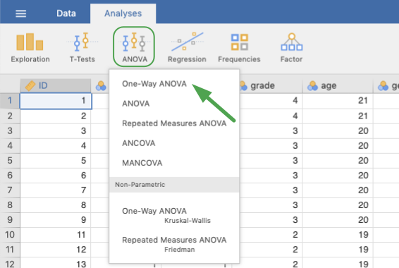
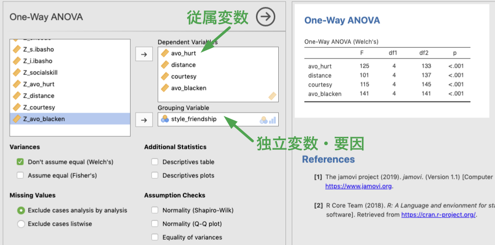
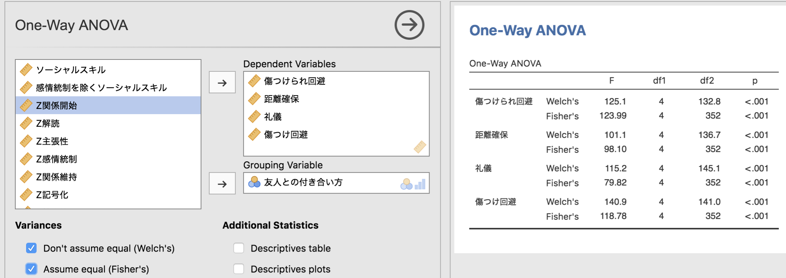
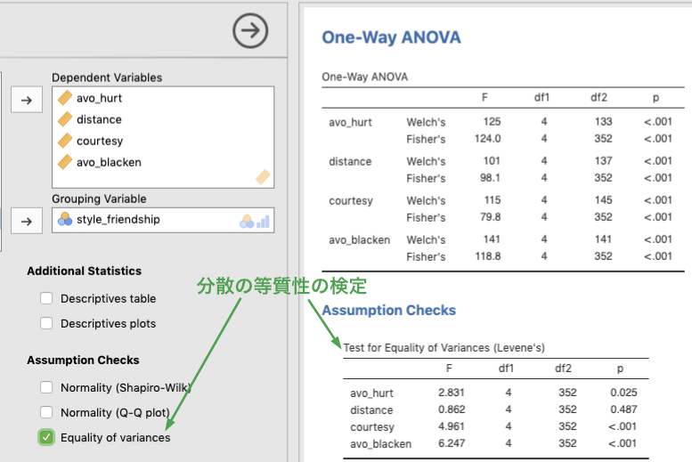
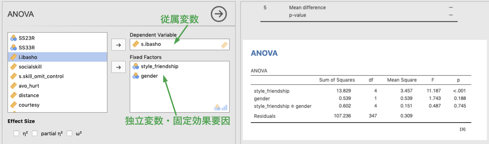
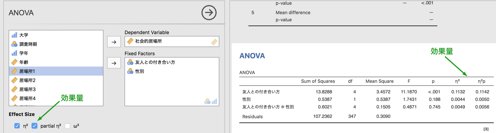
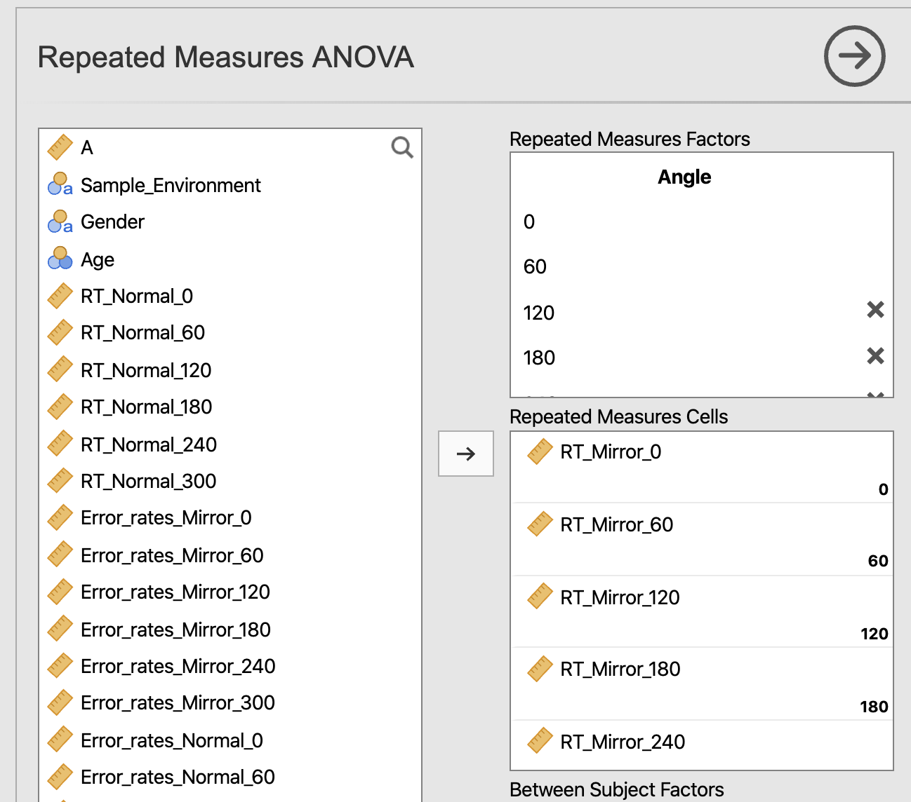
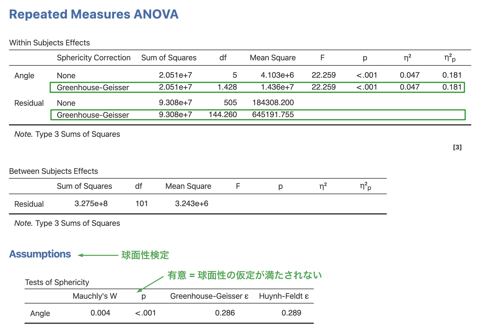
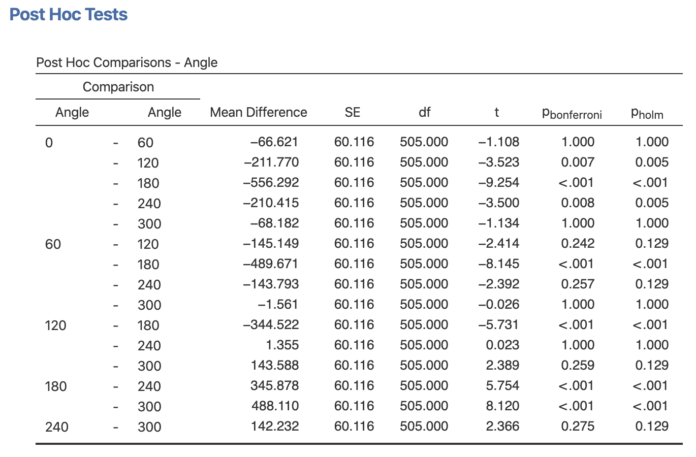
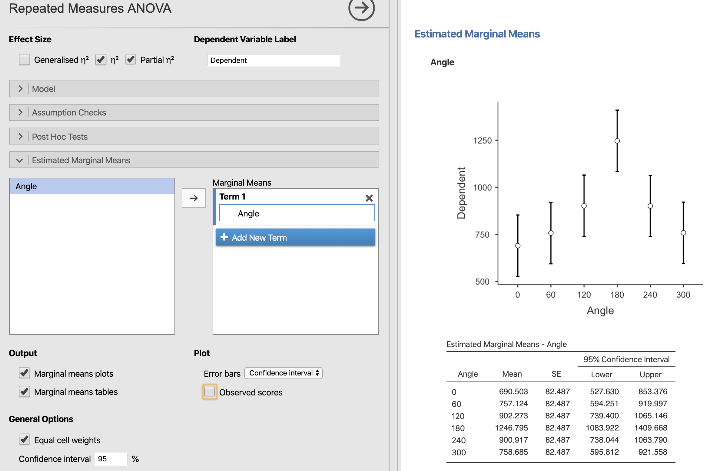

# 分散分析 {#anova}

ここでは，分散分析の方法について学びます。データは，永井 (2018) および，中村・眞嶋(2019) のものを用います。

## １要因完全無作為計画の分散分析

1要因完全無作為計画の分散分析では，対応のない1つの質的な独立変数（要因）の水準によって，従属変数の平均に差があるかどうかを検定します。。ここでは，永井 (2018) の中から，友人との付き合い方 (5水準, style_friendship) という要因によって，傷つけられやすさ回避 (avo_hurt)，距離確保 (distance)，礼儀 (courtesy)，傷つけ回避 (avo_blacken) に差があるかどうかを検定してみましょう。

データファイル (Nagai_2018.csv) を読み込み，変数の諸設定を行います。ここで扱う分散分析は，いずれも Analysis タブの ANOVA の中にあります。ANOVA のメニューの中には，1要因の分散分析 (One-Way ANOVA)，分散分析 (ANOVA)，反復測定デザインの分散分析 (Repeated Measures ANOVA)，共分散分析 (ANCOVA)，多変量共分散分析 (MANCOVA) や，ノンパラメトリック検定として，対応のない1要因のクラスカル・ウォリスの検定 (Kruskal-Wallis)，対応のある要因のフリードマン検定 (Friedman) が用意されています。

1要因の分散分析 (One-Way ANOVA) は，独立変数・要因は1つのみ，従属変数は複数指定可能ですが，分散分析は (ANOVA) では独立変数・要因は複数指定可能であるものの，従属変数は1つしか指定できません。しかしながら，使い方や出力の仕方は多少異なっていますが，One-Way  ANOVA で行った分析を ANOVA を使って行っても，当然ですが検定結果は変わりません。つまり，ここで行う1要因完全無作為計画の分散分析については，One-way ANOVA または，ANOVA のいずれを選択しても問題ありません。ここでは，One-way ANOVA で分散分析を行ってみましょう。

```{r fig.cap="Select One-Way ANOVA"}

```


### 変数の指定

One-way ANOVA を選ぶと下図のような画面になります。ここで，分析の対象となる従属変数は Dependent Variables へ，独立変数・要因は Grouping Variable へ移動します (SPSS でおなじみの方法ですね)。ここで，従属変数を複数指定した場合，それぞれの変数ごとに分散分析が行われますが，1要因の分散分析なので，独立変数は1つしか指定できません。なお，同じ独立変数の効果を，多数の従属変数について個別に検討することは，本当は検定の多重性の問題があって望ましくありません（特に，従属変数間に相関が予想される場合はなおさら）。しかしながら，ここではその問題には目をつぶりましょう。なお，このような場合は，通常，多変量分散分析 (Multiple Analysis of Variance, MANOVA) を行います (MANOVA は，jamovi では MANCOVA) の中で行うことができます。

```{r fig.cap="Options for One-way ANOVA"}

```

### 主効果の検定

独立・従属変数をそれぞれ指定すると，分析は自動で実行されます。初期状態では，群ごとの分散が等しくないという仮定をおいた分析 (Variances - Don't assume equal (Welch's)) が行われています。分散が等しいという仮定をおいた分析も行うようにしてみます。そのためには，Variances にある  Assume equal (Fisher's) というオプションにチェックを付けます。そうすると，右側の結果ウィンドウに，それぞれの検定の $F$ 値（上段が Welch，下段が Fisher），自由度 ($df1, df2$)，有意確率 $p$ が表示されます。今回のデータの場合，いずれの従属変数についても，独立変数である付き合い方の主効果が有意であることがわかります。

```{r fig.cap="Results of One-way ANOVA (equal variance)"}

```

### 分散の等質性の検定

分散の等質性の前提が満たされているかどうかは，Assumption Checks の中の Equality of variances にチェックを付けると分かります。このオプションにチェックを付けると，分散の等質性に関するルビーンの検定 (Levene's test) が行われます。今回のデータでは，等質性が保たれているのは距離確保 (distance) のみで，それ以外の従属変数では等質性の仮定が満たされていないことがわかります。しかし，上の主効果の検定で示されたように，分散の等質性を仮定した場合でも，仮定しない場合でも検定結果は変わらないので，結論としては全ての従属変数について，付き合い方 (style_friendship) の主効果は有意であると言えます。

```{r fig.cap="Tests of equality of variance"}

```

### 正規性の検定

従属変数が正規分布に従っているかどうかは，シャピロ−ウィルクの正規性の検定で確認します。正規性の検定は，Assumption Checks オプションにある Normality (Shapiro-Wilk) にチェックを付けてください。今回のデータでは，礼儀 (courtesy) と傷つけ回避 (avoid_blacken) で正規性の仮定が満たされないことがわかります。分散分析は従属変数が正規分布に従うことを前提とするパラメトリック検定なので，正規性が満たされない場合は，ノンパラメトリック検定であるクラスカル・ウォリスの検定を行わなければなりません。クラスカル・ウォリスの検定については，後に説明します。

```{r fig.cap="Tests of normality"}
knitr::include_graphics("./img/06anova/Anova07_assumption_normality.png")
```

### 多重比較

3水準以上の要因で主効果が有意であったときは，事後検定 (Post-hoc test) として多重比較を行う必要があります。多重比較は，Post-Hoc Tests オプションを展開し，Tukey または Games-Howell のいずれかを選んで実行します。前者の Tukey は分散が等しい場合，後者の Games-Howell は分散が等しくない場合に使われる方法です。また，事後検定の表示オプション (Statistics) として，平均値の差 (Mean difference)，有意確率 (Report significance)，検定統計量 (t and df) などの統計量を選ぶことができるようになっていて，デフォルトでは，平均値差と有意確率が表示されます。下図は，Tukey 法による多重比較の結果を示しています。

```{r fig.cap="Post-Hoc tests for One-way ANOVA"}
knitr::include_graphics("./img/06anova/Anova08_oneway_posthoc.png")
```


## ２要因完全無作為計画の分散分析

では，次に，2要因以上の分散分析の方法について見ていきましょう。ここでは，先ほどと同じ永井 (2018) のデータを用いて，友人との付き合い方 (style_friendship) と性別 (gender) を独立変数に，社会的居場所 (s.ibasho) を従属変数とする分散分析を行ってみましょう。2要因以上の分散分析の場合は，ANOVA メニューの 2つ目にある ANOVA を選んで行います。


```{r fig.cap="Select ANOVA"}
knitr::include_graphics("./img/06anova/Anova09_anova_menu.png")
```

すでに，述べたように，この ANOVA では，One-way ANOVA とは異なり従属変数は1つしか指定できません。それでは，従属変数である社会的居場所(s.ibasho) を Dependent Variable のボックスに，独立変数である付き合い方 (style_friendship)，性別 (gender) を Fixed factors のボックスに入れてみましょう。

```{r fig.cap="Options for ANOVA"}

```

分散分析の結果は，即時に表示されます。結果を見て分かるとおり，友人との付き合い方の主効果は有意 [$F(4, 347) = 11.2, p < .001$] ですが，性別の主効果，付き合い方×性別の交互作用は有意ではありません [$F(1, 347) = 1.74, p = .19; F(4, 345) < 1$]。

ただし，このままの分散分析表では，効果量が算出されていません。必要に応じて，イータ2乗 ($\eta^2$)，偏イータ2乗 (partial $\eta^2$)，またはオメガ2乗 ($\omega^2$) にチェックを付けてください。表の右側に，選択した効果量が出力されます。

```{r fig.cap="Effect size for ANOVA"}

```


### 事後検定

1要因の時と同じように，友人との付き合い方 (style_friendship) の主効果が有意でしたので，多重比較を行いましょう。多重比較は，Post Hoc Tests オプションで選択します。事後検定を行いたい変数を左の変数一覧から右のボックスに入れ，多重比較の際の有意水準の調整方法を選択してください（下図では Holm の方法を用いています）。また，対比較の効果量 (Cohen's d) を出力することもできます。

```{r fig.cap="Post-hoc tests for ANOVA"}
knitr::include_graphics("./img/06anova/Anova13_anova_posthoc.png")
```


### 推定周辺平均

水準ごとの推定周辺平均 (Estimated Marginal Means) を求めたいときは，Estimated Marginal Means オプションを開き，推定周辺平均を求めたい変数を Marginal Means のボックスに入れます。まずは，水準間の差が見られた友人との付き合い方 (style_friendship) について推定周辺平均を求めてみましょう (下図)。

初期状態では，推定周辺平均のプロット (Marginal means plots; エラーバーは信頼区間) が表示されています。表が必要な場合は，Marginal means tables にチェックを付けてください。また，プロットのエラーバーは，無し (None)，信頼区間 (Confidence interval)，標準誤差 (Standard error) の中から選ぶことができます。

```{r fig.cap="Estimated marginal means"}
knitr::include_graphics("./img/06anova/Anova16_emmeans.png")
```


交互作用について，水準の組み合わせごとの推定周辺平均を算出したい場合は，2つの変数を同時に同じ Term の中に入れることで可能です。まずは，下図のように新しい Term を作成し (Add New Term)，付き合い方 (style_friendship) と性別 (gender) を同時に，その Term の中に入れてみましょう。オプションの指定は上と同じです。

```{r fig.cap="Estimated marginal means (2 variables)"}
knitr::include_graphics("./img/06anova/Anova17_emmeans2.png")
```


## クラスカル・ウォリスの検定

分散分析は，従属変数が正規分布に従うことを前提としたパラメトリック検定です。そのため，正規分布しない従属変数に対して分散分析を行うのは，厳密に言えば問題があります。例えば先ほどの1要因完全無作為計画の分散分析では，礼儀 (courtesy) と傷つけ回避 (avoid_blacken) では正規性の仮定が満たされていませんでした。このような場合に行われるノンパラメトリック検定として，jamovi にはクラスカル・ウォリス (Kruskal-Wallis) の検定が用意されています。それでは，友人との付き合い方 (style_friendship) を独立変数，従属変数を礼儀，傷つけ回避とするクラスカル・ウォリスの検定を行ってみましょう。

クラスカル・ウォリスの検定は，ANOVA メニューにある Non parametric / One-Way ANOVA -- Kruskal-Wallis を選択します。

```{r fig.cap="Select Kruskal-Wallis test (non-partmetric one-way ANOVA)"}
knitr::include_graphics("./img/06anova/Anova18_nonpara_menu.png")
```


インターフェースは，1要因の分散分析 (One-Way ANOVA) と良く似ているので，同じように従属変数を Dependent Variables へ，独立変数を Grouping Variable へと入れます (下図)。礼儀 (courtesy) と傷つけ回避 (avoid_blacken) の双方ともに，友人との付き合い方 (style_friendship) による差があることがわかります。

```{r fig.cap="Options for Kruska-Wallis test"}
knitr::include_graphics("./img/06anova/Anova19_nonpara_ini.png")
```

クラスカル・ウォリスの検定にはオプションとして，効果量 ($\epsilon^2$) を出力するかどうか，有意であった場合に水準間の対比較を行うかどうかの設定があります (下図)。効果量は，クラスカル・ウォリスの検定結果表の末尾に，対比較はその下に出力されるようになっています (Dwass-Steel-Critchlow-Fligner pairwise comparison)。

```{r fig.cap="Effect size and pairwise comparison for Kruskal-Wallis test"}
knitr::include_graphics("./img/06anova/Anova20_nonpara_additional.png")
```


結果から，礼儀 (courtesy) については 1-2, 4-5 の間に差は無く，それ以外の組み合わせの間には差があることが見て取れます。また，傷つけ回避 (avoid_blacken) については，1-5 の間に差が無く，それ以外の組み合わせの間には差があることがわかります。

## 1要因反復測定計画の分散分析

1要因反復測定計画の分散分析では，対応のある1つの質的な独立変数（被験者内要因）の水準によって，従属変数の平均に差があるかどうかを検定します。。ここでは，中村・眞嶋 (2019) のデータ (NakamuraMajima_2019_MentalRotation_Wide.csv) を使って，心的回転実験の分析をしてみます。
心的回転では，通常，さまざまな角度に回転された図形が，正立像か反転像かを判断するよう求めます。
この実験では，0, 60, 120, 180, 240, 300 度回転させた正立像，および反転像に対する反応時間と，誤答率のデータが得られています。
ここでは，反応時間について角度による違いがあるかどうかを調べて見ましょう。

話を簡単にするため，ここでは反転像のみを対象として分析してみます。
被験者内要因をデザインに含む分散分析には，反復測定計画と混合計画がありますが，今回は被験者内要因が1つですので，1要因反復測定計画の分散分析となります。
ただし，jamovi では，反復測定計画であれ，混合計画であれ，分析メニューとしては，
反復測定デザインの分散分析 (Repeated Measures ANOVA) を使います。

それでは分析を始めましょう。まずは，データファイルを読み込んでください。今回使う変数は，反転像の反応時間を格納した，RT_Mirror_0, RT_Mirror_60, RT_Mirror_120, RT_Mirror_180, RT_Mirror_240, RT_Mirror_300 の6変数です（Mirror の後の数字は回転角度）。

反復測定デザインの分散分析は，Analyses タブの ANOVA メニューにある Repeated Measures ANOVA です。なお，Repeated Measures は，反復測定デザインだけではなく，被験者間要因と被験者内要因が混在した混合デザインでも同じメニューを使います。

```{r fig.cap="Select repeated measures ANOVA"}
knitr::include_graphics("./img/06anova/Anova21_repeated_menu.png")
```

被験者内要因を含む分散分析では，変数の指定の仕方が完全無作為デザインとは大きく異なっています。
参加者間要因の変数の場合，要因の水準を表す変数と従属変数が別々になっていましたが，被験者内要因の変数の場合は，一つの変数が一つの水準を表しており，従属変数にあたる変数が複数あります（加えて，水準を表す変数がありません）。
そこで，参加者内要因については，要因の名前や，水準数，さらには水準の名前（ラベル）を分析者の側で指定する必要があります。
それが，Repeated Measure Factors のボックスです。

```{r fig.cap="Repeated Measure Factor"}
knitr::include_graphics("./img/06anova/Anova22_repeated_Factor1.png")
```

Repeated Measure Factors のボックスにある，RM Factor 1 というのが1つめの参加者内要因になります。その下に Level とあるのが，その要因の水準を表しており，初期状態では Level 2，すなわち2水準までが用意されています。
また，それぞれの水準に対してデータ中のどの変数を割り付けるかは，下の Repeated Measure Cells のボックスで指定します（薄く書かれているように，それぞれのボックスに変数をドラッグアンドドロップします）。

それでは，今回のデータの場合は，要因が回転角(Angle)，水準数は6，使う変数は RT_Mirror_0, RT_Mirror_60, RT_Mirror_120, RT_Mirror_180, RT_Mirror_240, RT_Mirror_300 の6個ですので，以下の図のように指定します。

```{r fig.cap="Assign Repeated Measure Factor"}

```

図では隠れていて見えませんが，0, 60, 120, 180, 240, 300 の6つの水準があり，それぞれ対応する変数が割り付けられています。

### 球面性の仮定の検定

参加者内要因を含む分析では，水準間の分散が等しいかどうかを，球面性の検定によって検定します。
このとき，球面性の仮定が満たされない場合は，自由度の調整が必要となります。
jamovi では，SPSS と同様にモークリーの球面性の検定を行い，自由度の調整方法についても，SPSS と同様，Greenhouse-Geisser, Huynh-Feldt のイプシロンを用いた方法が使われます。

球面性の検定は，Assumption Checks にある Sphericity tests，この検定が有意な場合に行う自由度の調整は，Sphericity correction の箇所のチェックボックスにチェックを付ければ実行されます。

```{r fig.cap="Sphericity Test"}
knitr::include_graphics("./img/06anova/Anova24_repeated_Sphericity.png")
```

### 反復測定デザインの分散分析結果

さて，次に結果をみてみましょう。

```{r fig.cap="Resulsts - Repeated Measures ANOVA"}

```

まず，Assumptions の所にある，球面性の検定の結果を見ます。
すると，モークリーの W の値が 0.004, p < .001 であり，球面性の仮定が満たされていない（水準間で分散が異なる）ことがわかります。
ここが有意でない場合は，自由度の調整は必要ありませんが，今回のデータは分散が異なるため，自由度の調整が必要です。
ここでは，Greenhouse-Geisser のイプシロンを使った補正を行っており，結果は，Repeated Measures ANOVA の Within Subjects Effects の表に出力されています。
この結果からは，$F(1.4, 144.3) = 22.3, p < .001$，すなわち回転角によって反応時間が異なることがわかります。

### 多重比較

回転角の主効果が有意であることがわかりましたので，次に，多重比較を行いましょう。
多重比較は，Post Hoc Tests のオプションで指定します。
被験者内要因の場合は，Tukey 法ではなく，Bonferroni，またはその改良版である Holm の方法を使うことが推奨されています。

```{r fig.cap="Post Hoc Test"}
knitr::include_graphics("./img/06anova/Anova26_repeated_posthoc_menu.png")
```

多重比較を行うためには，多重比較をしたい要因を右側のボックスに移動し，有意確率の調整方法を選択します。

```{r fig.cap="Resulsts - Post Hoc Test"}

```

結果から，回転していない0°条件は，60°および300°（=反時計回りに60°）との間に差はありませんが，回転角度が120°を越えると反応時間が長くなることがわかります。
また，上下が逆になっている回転角180°は，その他全ての条件と有意に反応時間が異なり，180°は最も時間がかかっていることもわかります。

### 推定周辺平均

水準毎の推定周辺平均を求めたい場合は，完全無作為デザインの場合と同様に，Estimated Marginal Means のオプションを開き，推定周辺平均を求めたい要因を右側のボックスに入れます。
その他のオプションは，完全無作為デザインの場合と同様です。

```{r fig.cap="Estimated Margial Means (repeated measures ANOVA)"}

```

