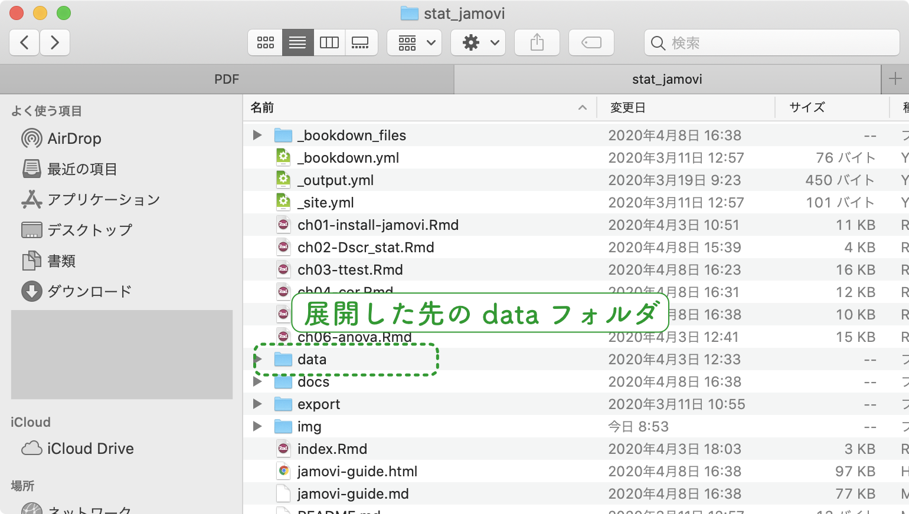
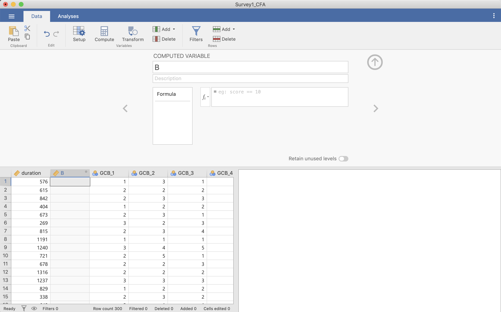
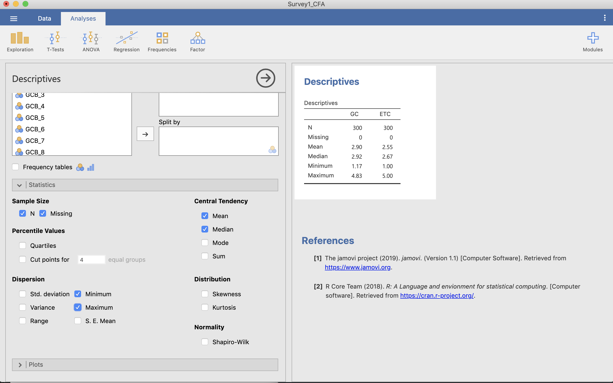
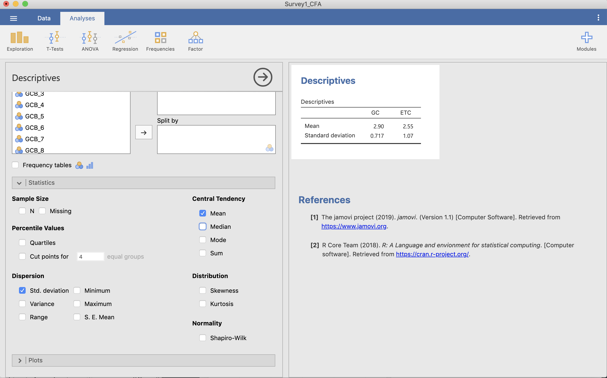
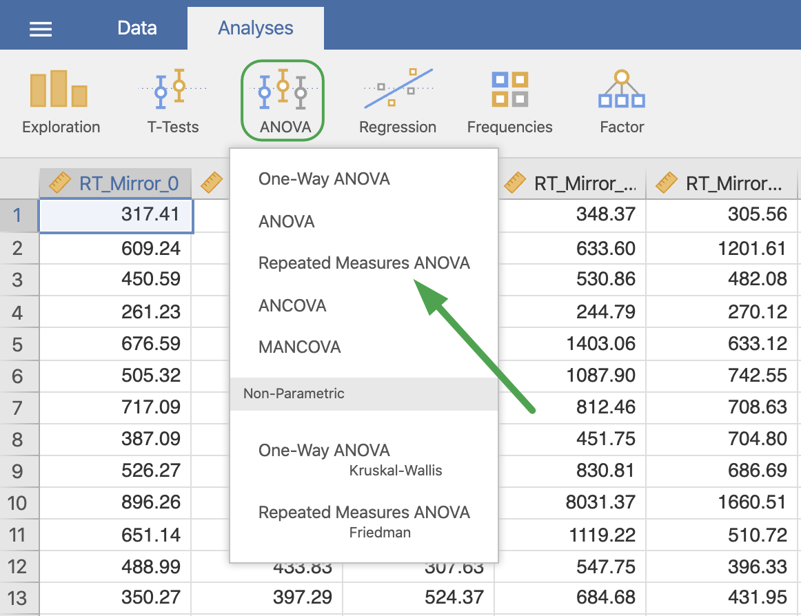
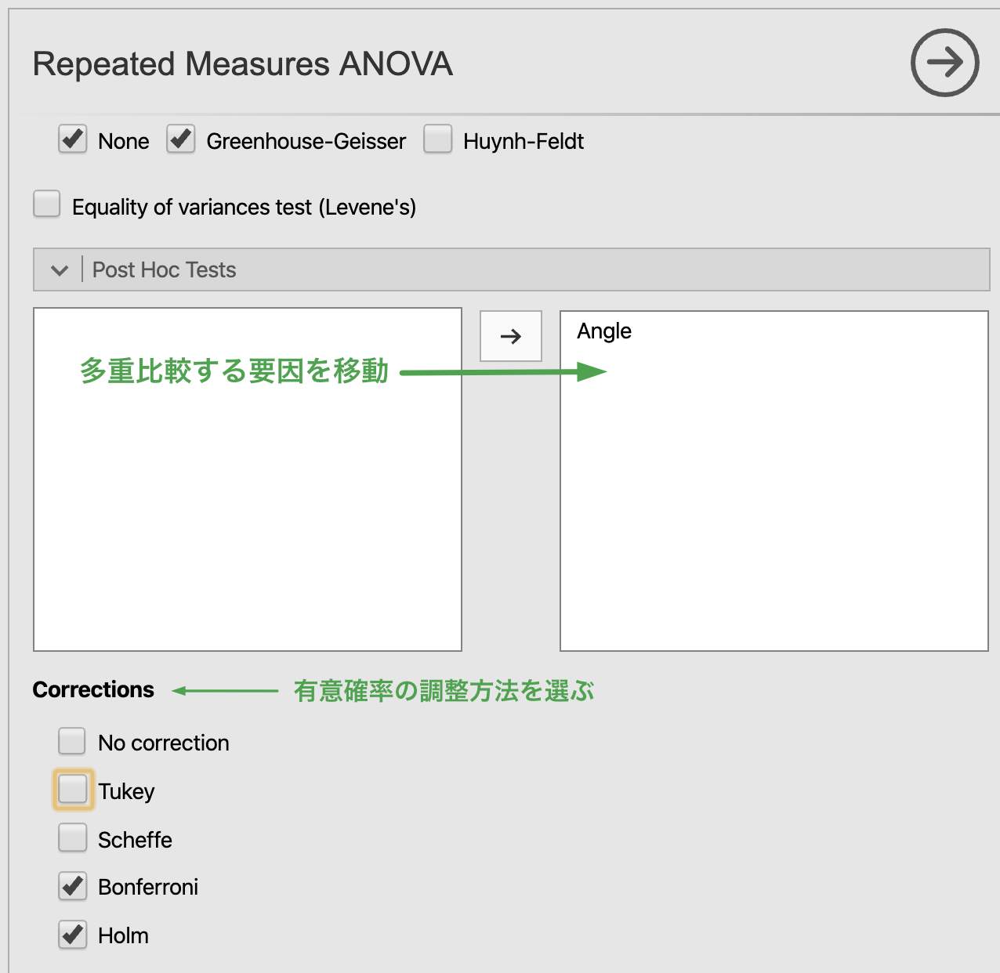

# このマニュアルについて

オープンソースの統計ソフトウェア jamovi (https://www.jamovi.org/) の北星学園大学版利用マニュアルです。
このマニュアルは，2019年度北星学園大学・特定研究費（共同研究費，課題名：学部・学科の垣根を越えた共通統計教育教材の開発，研究代表者：眞嶋良全）の費用援助を受けて作成されています。
まだまだ，修正中。

## 執筆者について

このマニュアルは，「学部・学科の垣根を越えた共通統計教育教材の開発」プロジェクトの成果として作成されています。
このプロジェクトは，北星学園大学・社会福祉学部の眞嶋良全を代表とし，同大文学部の石川悟，松浦年男，永井暁行，同大短期大学部の藤木晶子が参加して行われました。
プロジェクトメンバーの全員がこのマニュアルの執筆に参加しています。
なお，冒頭の著者名の表記は，執筆を担当した章の出現順序に沿っており，貢献度の多寡を示すものではありません。

## データについて

この教材で使用するデータは，[https://github.com/yoshi-mjm/stat_jamovi](https://github.com/yoshi-mjm/stat_jamovi){target="_blank"} の [data](https://github.com/yoshi-mjm/stat_jamovi/tree/master/data){target="_blank"} というフォルダの中にあります。また，これらのデータは，それぞれ，

- Majima, Y. (2017). The Feasibility of a Japanese Crowdsourcing Service for Experimental Research in Psychology. Sage Open, 27, 1. [https://doi.org/10.1177/2158244017698731](https://doi.org/10.1177/2158244017698731){target="_blank"}
- Majima, Y. & Nakamura, H. (2020). Development of the Japanese Version of the Generic Conspiracist Beliefs Scale (GCBS‐J). Japanese Psychological Research. [Advance Online Publication]. [https://doi.org/10.1111/jpr.12267](https://doi.org/10.1111/jpr.12267){target="_blank"}
- 永井暁行 (2018). ソーシャルスキルと態度による大学生の友人との付き合い方の分類―友人関係による居場所感の違い―. 教育心理学研究, 66, 54-66. [https://doi.org/10.5926/jjep.66.54](https://doi.org/10.5926/jjep.66.54){target="_blank"}
- 中村紘子・眞嶋良全(2019). 日本人クラウドワーカーによるオンライン実験と大学生による実験室実験における認知課題成績の比較. 基礎心理学研究, 38, 33-47. [https://doi.org/10.14947/psychono.38.10](https://doi.org/10.14947/psychono.38.10){target="_blank"}

を使用しています。
なお，Majima & Nakamura (2020) については，全てのデータが [https://osf.io/24w8u/](https://osf.io/24w8u/){target="_blank"}  からダウンロードすることが可能です。

## データのダウンロードについての補足

### リポジトリを一括ダウンロードする

上の [data](https://github.com/yoshi-mjm/stat_jamovi/tree/master/data){target="_blank"} というフォルダをクリックして表示されるファイルは，直接1つ1つのファイルをダウンロードできませんので注意してください。
このサイトは Git(Hub) を使ってバージョン管理をしているためです。
データをダウンロードする一番簡単な方法は，データも含めてサイトの全てを一括ダウンロードする方法です。
一括ダウンロードをするためには，上のリンクをクリックして data フォルダに移動し

<div class="figure">

<p class="caption">(\#fig:unnamed-chunk-1)GitHub リポジトリ</p>
</div>

図に示されるように <> Code と書かれているタブか，リポジトリの名前である stat_jamovi をクリックします。
リポジトリのトップに移動したら，

<div class="figure">

<p class="caption">(\#fig:unnamed-chunk-2)Zip 形式でのダウンロード</p>
</div>

右側にある緑色の Clone of download と書かれたボタンをクリックし，Download ZIP を選んでください。
リポジトリのファイルが一括で zip ファイルでダウンロードされます。
zip ファイルを展開した先に出来る data フォルダにデータが入っています。

<div class="figure">

<p class="caption">(\#fig:unnamed-chunk-3)展開した先の data フォルダ</p>
</div>

このガイドブックを授業で使用する場合は，授業担当者から別途指示があるかもしれませんので，その場合はその指示に従ってください。

### Git(Hub) を使う

Git というのは，プログラムのソースコードなどをバージョン管理するツールであり，[GitHub](https://github.com/){target="_blank"} は，Git を使った開発者を支援する Web サイトです。Git および GitHub の詳細はここでは省略しますが，[GitHub Desktop](https://help.github.com/ja/desktop){target="_blank"}というアプリケーションを使うと，リポジトリのコピー（クローン）なども簡単にできて便利です。

## その他の参考文献

jamovi の使い方については，下のサイトも参考になります。あわせてご覧ください。

- jamovi で学ぶ心理統計 [https://bookdown.org/sbtseiji/lswjamoviJ/](https://bookdown.org/sbtseiji/lswjamoviJ/){target="_blank"}

<!--chapter:end:index.Rmd-->

# jamovi のインストールと操作の基礎 {#install}

## jamovi のインストール

jamovi は，プロジェクトの Web サイト (https://www.jamovi.org/) からダウンロードできます。Web サイトのダウンロードをクリックすると，OS に応じた選択肢がトップに表示されるので，安定版 (solid) をダウンロードしましょう。図の場合は，Windows 用の 1.1.9 solid が最新の安定版となっています。

<div class="figure">

<p class="caption">(\#fig:unnamed-chunk-4)Web site of jamovi</p>
</div>

ダウンロードが完了したら，ファイルのアイコン (下図は Windows の安定版 1.1.9 の場合) をダブルクリックしてインストールを開始しましょう。

<div class="figure">

<p class="caption">(\#fig:unnamed-chunk-5)jamovi installer</p>
</div>

インストールは，その他のアプリと同じようにウィザードによって進行し，特に難しいことはありません。

インストールが完了したら，ソフトウェアを起動してください。


## jamovi の基本操作

jamovi は Excel や SPSS と良く似たスプレッドシート形式の外観をもっています。また，トップレベルのメニューは，データの各種操作を行う Data と，分析を行う Analysis の2つであり，とてもシンプルです。ファイルの操作は，Data の左にある Ξ のような形をしたメニューをクリックして行います。また，設定は，画面右上にある三つの点が縦に並んだボタンをクリックして行います。

<div class="figure">

<p class="caption">(\#fig:unnamed-chunk-6)Interface of jamovi</p>
</div>

### データの入力

では，まずデータを入力してみましょう（表1）。使い方は，Excel や SPSS とよく似ていて，特に難しいことはありません。なお，A 列は被験者番号 (PID; S1-S6)，B 列は年齢 (Age)，C 列は性別（Gender; 1=男性, 2=女性），D 列は外向性の測定項目1 (Ex1)， E 列は外向性の測定項目2 (Ex2R, 逆転)となっています。

Table: 年齢と性別のデータ

| A    | B    | C    | D    | E    |
| ---- | ---- | ---- | ---- | ---- |
| S1   | 24   | 2    | 6    | 2    |
| S2   | 29   | 1    | 3    | 1    |
| S3   | 22   | 2    | 5    | 2    |
| S4   | 27   | 1    | 6    | 2    |
| S5   | 22   | 1    | 6    | 6    |
| S6   | 30   | 2    | 6    | 2    |

データを入力し終えると 下図のようになっているはずです。

<div class="figure">

<p class="caption">(\#fig:unnamed-chunk-7)Data entry</p>
</div>

次に，列（変数）の設定を行います。Data タブをクリックし，1列目 (A) のいずこかのセルが選択されている状態で Setup ボタンをクリックしましょう。すると，下図のような設定画面となるので，変数名 (Data variable) に PID を入力します。変数（データ）の種類としては，連続量 (Continuous)，順序尺度 (Ordinal)，名義尺度 (Nominal) の他に，jamovi に特有の変数種類として ID の4種類があります。なお，ID はデータの型としては名義尺度なのですが，変数の値をメモリ上に貯蔵しないので，メモリの消費を抑えることができます。

<div class="figure">

<p class="caption">(\#fig:unnamed-chunk-8)Variable setup (ID)</p>
</div>

それでは，A 列は変数名を PID (変数種別は ID)，B 列は変数名を Age (種別 Continuous)，C 列は変数名を Gender (種別 Nominal) としてみましょう。D，E 列はそれぞれ変数名を Ex1, Ex2R (種別 Continuious) とします。列間の移動は，設定画面左右にある <，> をクリックするとできます。なお，C 列の性別については，1 = Men, 2 = Women とするようにラベルを付けます。値ラベルは，Levels ボックスに入力してください。

<div class="figure">

<p class="caption">(\#fig:unnamed-chunk-9)Variable setup (gender)</p>
</div>

変数の設定が終わると，下図のようになるはずです。

<div class="figure">

<p class="caption">(\#fig:unnamed-chunk-10)Finish data entry</p>
</div>

### 変数の計算

次に，変数の値を使った計算について説明します。D, E 列はそれぞれ，外向性を測定する質問項目であり，それぞれは 7 件法 (1-7) で評価されています (1 = 全く違うと思う, 7 = 強くそう思う)。しかし，E 列の Ex2R は逆転項目となっていて，1 になるほど外向的であるため，逆転項目の処理が必要です。逆転項目の処理は，一般に，

```
(件数+1) - 評価値
```

で行われます。jamovi では，変数の値を使った計算は，Data タブにある Compute をクリックして行います。自動的に F 列が選択され，変数名や計算式を入力する画面となりますので，変数名 (Computed Variable) を Ex2，計算式として，

```
8-Ex2R
```

と入力しましょう。

<div class="figure">

<p class="caption">(\#fig:unnamed-chunk-11)Calculate reverse score</p>
</div>

さらに，2つの外向性項目の合計点を，G 列に，Extraversion という変数名で作成します。

<div class="figure">

<p class="caption">(\#fig:unnamed-chunk-12)Calculate sum</p>
</div>

### ファイルの保存

ファイルの各種操作は，Data タブの左側にある Ξ のような形をしたボタンをクリックして行います。選ぶことができるのは，新規作成 (New)，データを開く (Open)，外部ファイルからのインポート (Import)，上書き保存 (Save)，名前を付けて保存 (Save as)，外部ファイルへのエクスポート (Export) の 6 通りです（メニューの下に，最近使用したファイルのリストが表示されます）。

それでは，ここまで作成したファイルを保存しよう。Save または Save as をクリックするとファイル名やフォルダを指定するダイアログが表示されますので，フォルダとファイル名に注意して保存しよう。ただし，Save は，初回のファイル名が設定されていない場合のみ，ダイアログが表示され，一度保存した状態で Save をクリックした場合は，そのファイルへの上書き保存となりますので注意してください。フォルダをデフォルトから変える場合は，Browse ボタンをクリックすると保存用のダイアログが表示されるので，目的のフォルダを選択し，ファイル名を入力してください。

<div class="figure">

<p class="caption">(\#fig:unnamed-chunk-13)Save file</p>
</div>

### ファイルを開く

ファイルを開く場合は，Open をクリックし，開きたいファイルを選択します。保存の時と同様，フォルダを移動したい場合は，Browse ボタンをクリックします。ファイル形式としては，jamovi のデータ (*.omv) 以外にも，CSV や各種統計ソフトウェアのデータファイル (SPSS, R, Stata, SAS, JASP) を直接開くことができます。Excel には対応していませんが，Excel において CSV 形式で保存することによって，jamovi でも開くことができるようになります。

### インポートとエクスポート

エクスポートは，データを，jamovi の他，統計ソフトウェアのデータ (SPSS, R, Stata) あるいは，html，pdf 形式で出力することができます。

インポート → 後日加筆

### その他データの操作

#### 値の割り当て

ある変数の値を元に，別の変数に値を割り当てたい場合は，Data タブにある Transform を使います。例えば，年齢 (Age) を25歳以上 / 未満に分けたい場合は，Age のどこかが選択されている状態で Transform をクリックします。すると下図のように，Age(2) という名前で新たな変数が作成されるので，変数名と値の割り当て規則を設定します。

<div class="figure">

<p class="caption">(\#fig:unnamed-chunk-14)Recode variable</p>
</div>

ここでは，変数名を Age_grp とします。割り当て規則は，using transform のドロップダウンボックスをクリックし，新規作成 (Create New Transform) を選択して設定します。

<div class="figure">

<p class="caption">(\#fig:unnamed-chunk-15)Recode setup</p>
</div>

新規作成を選ぶと，割り当て規則の編集画面となるので，規則の名前と条件を入力しましょう。ここでは，条件規則について，25歳未満を1, それ以上は2とするようにコーディングしたいと思います。規則を編集する場合，Add recode condition をクリックします。デフォルトでは下図のように元の変数をそのまま使用するようになっているので，Add recode condition をクリックし，

```
if $source < 25 use 1
else use 2
```

となるように入力します。

<div class="figure">

<p class="caption">(\#fig:unnamed-chunk-16)Recode rule</p>
</div>

上で説明した，変数の値を使った計算や，値の再割り当ては，任意の位置の列に挿入したり，データの末尾に挿入することもできます。その場合は，Variables グループの中にある Add をクリックし，Insert（挿入）または Append (末尾に追加) を，それぞれの操作ごとに行います。データ (行) を途中で挿入する場合は，Rows グループの中の Add をクリックし Insert を，行を末尾に追加したい場合は Add → Append を選択することで可能です。

#### フィルター（データの選択）

データの中から一部のみを選択したい場合は，Rows グループにある Filters を使います。試しに，男性のみを選択してみましょう。まず，Filters をクリックし，選択の条件に，

```
Gender == "Men"
```

と入力します。ここで，= が一つだけだと，代入を意味するため条件式としては正しくなく，== と2つ重ねることによって，Gender の値が Men と一致する場合，という意味になりますので注意してください。なお，条件式の下にある description フィールドは，フィルタにつける補足説明なので，あってもなくても動作自体に影響はありません。

<div class="figure">

<p class="caption">(\#fig:unnamed-chunk-17)Apply filter</p>
</div>

適用したフィルタを解除する場合は，フィルタ変数そのものを削除するか，フィルタ変数の設定 (setup) で，inactive にしてください。

<div class="figure">

<p class="caption">(\#fig:unnamed-chunk-18)(De)activate filter</p>
</div>

<!--chapter:end:ch01-install-jamovi.Rmd-->

# 記述統計 {#descriptives}

本節では記述統計量の操作方法を解説します。計量データを分析するときにはいきなり統計を始めず，まずはそのデータの大まかな傾向を掴む必要があります。そのために見るのが記述統計量と呼ばれるものです（要約統計量，基本統計量，代表値などとも）。記述統計量の代表的なものとしては平均値と分散があるので，ここではjamoviを使ってその計算方法を説明します。

## 平均化する
ここではMajima & Nakamura (2019)のStudy 1のデータを使います。Majima & Nakamura (2019)ではGCBS(一般陰謀論者信念尺度, Generic Conspiracist Beliefs Scale)，BCTI(陰謀理論目録の信念,  Belief in Conspiracy Theories Inventory)，OICM(【日本語】,One-Item Conspiracy Measure)の記述統計量を出していますが，ここではGCBSのうち，EFA (exploratory factor analysis) subsampleのみ扱います。GCB-Jは一般陰謀論者信念尺度と呼ばれ，GCは一般陰謀者信念とETC(地球外陰謀論者信念)という2つの下位尺度からなります。この2つの下位尺度の記述統計量を出すためにはそれぞれの尺度の平均値を出す必要があります。

CSVファイル(Survey1_EFA.csv)を読み込みます。

<div class="figure">

<p class="caption">(\#fig:unnamed-chunk-19)データ読み込み</p>
</div>

列を見るとGCB_1からGCB_15まであることが分かります。GCとETCを出すのに必要な変数は次のように分かれています。

* GC (12項目)
  * GCB_1, GCB_2, GCB_4, GCB_5, GCB_6, GCB_7, GCB_9, GCB_10, GCB_11, GCB_12, GCB_14, GCB_15
* ETC (3項目)
  * GCB_3, GCB_8, GCB_13

それぞれの下位尺度の記述統計量を出すにあたり，このデータをそれぞれ平均化する必要があります。平均化は次の手順で行います。まずDataタブを選択します。

<div class="figure">

<p class="caption">(\#fig:unnamed-chunk-20)Data タブ</p>
</div>

この状態で[Compute]を押します。この状態で新しい変数が追加されていますので，COMPUTED VARIABLE（おそらく「B」と書かれている）に新たな変数の名前を付けます（ここではGCにします）。

<div class="figure">

<p class="caption">(\#fig:unnamed-chunk-21)Compute で平均を出す</p>
</div>

そして，2行下の=の後ろに計算式を入れます。ここでは必要な変数を全て足し，項目数の12で割ります。そうすると平均した結果が出てきます（1行目の2.583など）。

<div class="figure">

<p class="caption">(\#fig:unnamed-chunk-22)平均を計算</p>
</div>

ETCについても出す必要があるので，再び[Compute]を押して，変数の名前(ETC)を入れ3つの変数を足し，3で割ります。

<div class="figure">

<p class="caption">(\#fig:unnamed-chunk-23)Descriptives を選択</p>
</div>

## 記述統計量の計算

記述統計量を出すためにAnalysisタブを押し，[Exploration]から[Descriptives]を選択します。

<div class="figure">

<p class="caption">(\#fig:unnamed-chunk-24)変数を選択</p>
</div>

そうすると記述統計量のための画面になります。

<div class="figure">

<p class="caption">(\#fig:unnamed-chunk-25)デフォルトの結果</p>
</div>

ここでここで先ほど計算したGCとETCを選択し「→」を押すと，右の画面にデフォルトの記述統計量が出てきます。

<div class="figure">

<p class="caption">(\#fig:unnamed-chunk-26)記述統計量</p>
</div>

Statisticsを押すと様々な項目があるので，必要な記述統計量の項目を選びます。ここではMajima & Nakamura (2019)に従い「平均 (Mean)」と「標準偏差 (Std. deviation)」を選択してみましょう。

<div class="figure">

<p class="caption">(\#fig:unnamed-chunk-27)Statistics の画面</p>
</div>

このようにして記述統計量として平均と標準偏差を出すことができました。

<!--chapter:end:ch02-Dscr_stat.Rmd-->

# 平均値の検定 {#means}

## 対応のないt検定

本項ではt検定の分析方法を解説します。ここでは永井(2018)によるデータを使い，居場所尺度の下位尺度である「社会的居場所」の平均得点が男性と女性で異なるのかどうかを分析していきます。t検定は，データの正規性や仮説の立て方によって適切な分析方法を選択していく必要があります。ここでは，男性と女性という異なる２つの標本を用い，Jamoviniを使った独立した標本による対応のないｔ検定の分析方法を解説します。

対応のないt検定を実施する場合，等分散性が仮定されているかどうかによってt値の計算方法が変わるため，前提条件として２標本の分散が同じか否かの判定が必要となります。Jamoviの場合，t検定を分析する際のオプションとしてこの検定を実施することができます。そこで，本稿ではスチューデントのt検定と等分散性の検定を同時に実施し，等分散が確認できればそのままt検定の結果を採用し，等分散性が確認できなければ等分散性を仮定しないウェルチのt検定に切り替えて分析する方法を紹介します。

また，t検定の場合，仮説の立て方によって棄却域が変わります。ここで想定可能な仮説は，１）男性の方が「社会的居場所」得点が高い可能性，２）逆に女性の方が高い可能性，３）男女間で何らかの相違がある可能性の３つです。前者の１）と２）とでは，理論的にまったく異なる結果であることが分かります。どの仮説を採用するかは，先行知見と照らし合わせながら適切な根拠を示すことができる仮説を採用します。今回は，研究内容には踏み込まずに，操作方法を重点的に説明するため，３）の男女間で相違があるか否かを調べる両側検定を行っていきます。

では，この概要を踏まえて，基本統計量の算出とt検定の実施を行っていきましょう。

### 基本統計量の算出

まず，適切な分析方法を選ぶための準備として，男女のサンプル数，平均値，標準偏差，ヒストグラム，密度曲線を見ていきます。t検定の理解を深めるために必要な手順ですが，手早く分析したい場合にはこの基本統計量の算出は飛ばすこともできます。その場合には，後述するt検定の分析の際にAdditional Statisticsカテゴリー内にあるDescriptivesを追加します。

Jamoviで基本統計量を算出する場合，「Analyses（分析）」タブより「Exploration（記述統計）」を選択し，さらに「Descriptives（基本統計量）」を選択します。変数リストより→のボタンを押して，［Variables（変数）］に「社会的居場所 (s.ibasho) 」を，［Split by（グループ変数）］に「性別 (gender)」を指定します。

<div class="figure">

<p class="caption">(\#fig:unnamed-chunk-28)記述統計量の計算</p>
</div>

次に［Statistics］より，オプション設定を１つ行います。Dispersion（ばらつき）カテゴリーにあるStd. deviation（標準偏差）にチェックを追加します。

<div class="figure">

<p class="caption">(\#fig:unnamed-chunk-29)統計量の選択メニュー</p>
</div>

次に，算出結果を見ていきます。性別の符号は，１＝男性，２＝女性になります。サンプル数をみると，男性が122名，女性235名であることが分かります。「社会的居場所」得点の平均値は，男性が2.98，女性が3.13と女性の方が0.15高いことが分かります。なおこの２つの平均値に有意な差があるのかどうかは，t検定の結果を見て判断しましょう。また，分布のばらつきを調べる標準偏差は，男性が0.642，女性が0.559と男性の方が0.08数値が大きくなっています。このばらつきが同じかどうかについてはt検定の計算方法を決める際に必要となります。等分散性の検定でさらに判断していきましょう。また，平均やばらつきなどの分布の特徴は，数値だけでなく，全体を視覚的に捉えることも大切です。以下のPlotsにある作図オプションも見ていきましょう。

<div class="figure">

<p class="caption">(\#fig:unnamed-chunk-30)記述統計量の計算結果</p>
</div>

Jamoviによる作図は非常に簡便です。［Plots］よりHistograms（ヒストグラム）カテゴリーにあるHistogram（ヒストグラム）と（密度曲線）にチェックするだけで作図が行われます。

<div class="figure">

<p class="caption">(\#fig:unnamed-chunk-31)作図メニュー</p>
</div>

<div class="figure">

<p class="caption">(\#fig:unnamed-chunk-32)ヒストグラムと密度曲線</p>
</div>

　凸凹しているのがヒストグラム，曲線がヒストグラムをカーネル平滑化した密度曲線になります。Jamoviでは，ヒストグラムに密度曲線を重ねて作図することができます。その他に，Box Plot（ボックスプロット）では，データの中央値・四分位範囲・範囲をシンプルな形で視覚化する箱ひげ図が，Q-Q（Q-Qプロット）では，標本が正規性の仮定を満たしているかどうかを視覚的に確認することができます。

### t検定の実施

では，上記の基本統計量の結果を理解した上で，t検定を実施していきます。まず「Analyses」タブより「T-Tests」を選択すると３つの分析タイプが出てきます。各分析タイプの概略を以下に記します。

#### t検定の種類

**Independent Samples T-Test（独立標本のｔ検定）**

男性のデータと女性のデータのように，対応のない２つの標本の平均値の差を求めたいときに用います。Jamoviでは，スチューデントの対応なしｔ検定，ウェルチ検定，マン・ホイットニーのＵ検定の３つを行うことができます。

**Pared Sample T-Test（対応のある標本のｔ検定）**

同じ人で走る前のデータと後のデータように，対応のある２つの標本の平均値の差を求めたいときに用います。Jamoviでは，スチューデントの対応ありｔ検定，ウィルコクソンの符号順位検定の２つを行うことができます。

**One Sample T-Test（１標本のｔ検定）**

10人の身長の平均と日本人の平均身長のように，１組のデータとある固定値を比較したいときに用います。Jamoviでは，スチューデントの対応ありｔ検定，ウィルコクソンの符号順位検定の２つを行うことができます。

<div class="figure">

<p class="caption">(\#fig:unnamed-chunk-33)独立な2群の t 検定メニュー</p>
</div>

ここでは，男性と女性という異なるサンプルデータを分析するため，Independent Samples T-Test（独立標本t検定）を選択します。続いて，選択した画面の変数リストより→のボタンを押して，Dependent Variables（従属変数）に「社会的居場所 (s.ibasho)」を，Grouping Variable（グループ変数）に「性別 (gender)」のグループ変数を指定します。

<div class="figure">

<p class="caption">(\#fig:unnamed-chunk-34)変数の選択</p>
</div>

次に，以下の分析方法を確認もしくは追加していきます。

#### Tests（検定方法）

**Student’s（スチューデント検定）**：分散の等質性を仮定したスチューデントのｔによる検定を行います。さらにオプションであるBayes factor（ベイズ因子）では，平均値の差に関するベイズ因子を算出します。
**Welch’s（ウェルチ検定）**：分散が等質であるという仮定を設けないウェルチ法によるｔ検定を行います。
**Mann-Whitney U（マン・ホイットニーのＵ）**：分布の正規性が確認できない場合に行います（ノンパラメトリック検定）。男性と女性の各分布の正規性を調べるには，基本手統計量のところでQ-Qプロットやシャピロ・ウィルク検定にチェックを入れて確認することができます。t検定のオプションでもQ-Qプロットの作図やシャピロ・ウィルク検定を実施することができますが，男性と女性をまとめたデータ全体の分布に対する評価が行われます。２標本それぞれの分布の正規性を確認したい場合には，基本統計量のところで確認すると良いでしょう。これら正規性の検定は必要に応じて実施し，分布の正規性が確認できなければノンパラメトリック検定を実施します。

ここでは，ひとまずスチューデントのt検定が選択されているのを確認しましょう。

#### Hypothesis（仮説）

**Group 1 ≠ Group 2**：『グループ１と２の平均値に差があるかどうか』を調べる両側検定を行います。ここでは，男性（＝１）と女性（＝２）の得点に違いがあるかどうかを調べることになります。
**Group 1 > Group 2**：『グループ１の平均値がグループ２の平均値より有意に高いかどうか』を調べる片側検定を行います。ここでは，男性（＝１）の方が女性（＝２）より平均値が高いかどうかを調べることになります。
**Group 1 < Group 2**：『グループ２の平均値がグループ１の平均値より有意に高いかどうか』を調べる片側検定を行います。ここでは，女性（＝２）の方が男性（＝１）よりも平均値が高いかどうかを調べることになります。

ここでは，両側検定を行うので，Group 1 ≠ Group 2が選択されているのを確認しましょう。

#### Missing values（欠損値）　

**Exclude cases analysis by analysis**：欠損値がある場合，各分析ごとに該当する行を除外します。
**Exclude cases listwise**：欠損値が含まれている行全体を分析から除外します。

ここでは，Exclude cases analysis by analysisが選択されていることを確認しましょう。

#### Additional Statistics（その他の統計量）

**Mean difference（平均値の差）**：平均値の差と差の標準誤差を算出します。
**Effect size（効果量）**：Cohen's d（コーエンのｄ）を算出します。
**Confidence intervals**（信頼区間）：指定した幅の信頼区間を算出します。
**Descriptives（記述統計量）**：N（標本サイズ），Mean（平均値），Median（中央値），SD（標準偏差），SE（標準誤差）を算出します。
**Descriptives plots（記述統計量プロット）**：Mean(95%CI)（平均値（95%信頼区間），Median（中央値）のグラフを作成します。

ここでは，Descriptivesにチェックを入れましょう。すでに基本統計量の算出のところで確認した数値ですので，出力結果についての解説は省きますが，基本統計量の算出をなるべく簡素化したい場合にはこのDescriptivesで確認すると良いです。

#### Assumption Checks（分析に関わる前提条件の確認）

**Normality (Shapiro-Wilk)（シャピロ・ウィルク検定）**：データ全体のWとp値が算出されます。データが正規分布から乖離していないかどうかを確認します。この検定の帰無仮説は「データに正規性がある」なので，p値が0.05以下の場合には『データに正規性がない』ことになります。
**Normality (Q-Q plot)**：データが正規分布しているかどうかを視覚的に確かめるためのＱ‐Ｑプロットを作図します。
**Equality of variances（分散の等質性）**：分散が等質であるかどうかを調べるために，Levene（ルビーン）の等分散性検定を実施します。今回紹介している独立標本のｔ検定にのみ必須の前提条件となります。対応のある標本のｔ検定および１標本のｔ検定に，このオプションはありません。

ここでは，Equality of variances（分散の等質性）にチェックを入れます。はじめに述べたように，Jamoviで独立標本のｔ検定を行う場合，ここで等分散性の検定を行うことができます。そのため，t検定と等分散性の検定結果は同時に出力されます。この等分散性の検定結果によって，等分散性が仮定されない場合にはスチューデントのt検定からウェルチのt検定に変更する必要があります。

<div class="figure">

<p class="caption">(\#fig:unnamed-chunk-35)分散の等質性の検定の実行</p>
</div>

### 結果の見方

#### 等分散性の検定結果

結果は，t検定の結果ではなく，検定の前提条件となるAssumptionsにあるTest of Equality of Variances(Levene's)の結果から見ていきます。

<div class="figure">

<p class="caption">(\#fig:unnamed-chunk-36)等質性の検定の結果</p>
</div>

等分散性の検定の場合，p < 0.05 であった場合は『分散に差がある』，p ≧ 0.05 であった場合は『分散に差がない』となります。今回のp値は0.182なので『分散に差がない』つまり等分散性を仮定したスチューデントのt検定が適切な検定となります。今回はこのスチューデントのt検定を選択していたので，そのままt検定の結果を見ていきます。『分散に差がある』場合には，TestsカテゴリーにあるWelch's（ウェルチのt検定）にチェックを入れます。

#### t検定の結果

では，スチューデントのt検定の結果を見てみましょう。

<div class="figure">

<p class="caption">(\#fig:unnamed-chunk-37)t 検定の結果</p>
</div>

ｔ値は2.24，ｐ値は0.026と有意な差が見られています。したがって，男性と女性は「社会的居場所」において異なる（t(355)=2.24, p < .05)ことが分かりました。

では，さいごにもう一つt検定を行ってみましょう。基本統計量のところで確認したように「社会的居場所」の平均値は，女性の方が男性よりもが高い結果が得られていました。もし理論的に女性の方が「社会的居場所」得点が高くなる可能性を説明できるのであれば，統計的にも女性の方が得点が高いことを示した方が説得力が高まります。そこで，ここでは理論的根拠を説明できることを仮に想定した場合，女性の方が「社会的居場所」得点が高くなるのかどうかを調べる片側t検定の結果がどうなるのか試してみます。

分析は先ほどとすべて同じですが，次の１カ所のみ変更します。Hypothesis（仮説）をGroup 1 < Group 2に変更します。

<div class="figure">

<p class="caption">(\#fig:unnamed-chunk-38)片側検定への変更</p>
</div>

<div class="figure">

<p class="caption">(\#fig:unnamed-chunk-39)片側検定の実施</p>
</div>

両側検定と同じく有意になりました。この場合，変更されたのはp値の0.013のみで，t値，自由度はそのままの値です。分布の両側を棄却域にするよりも，片側を棄却域にする方が若干検出力が高くなります。この結果からは，女性の方が男性よりも「社会的居場所」得点が有意に高い（t(355)=2.24, p < .05)ことを示すことができます。このように両側と片側検定は仮説に応じて使い分けていきます。

## 対応のある t 検定

次に，同一の標本から複数回測定値を得た場合に行われる対応のある2群の t 検定について説明します。ここでは，Majima (2017) のデータを使い，フランカー課題において，中央のターゲット刺激と周辺刺激が一致している場合 (con) と，一致しない場合 (incon) とで，反応時間が異なるかどうかを分析していきます。
なお，Majima (2017) では，試行の種類（一致・不一致）と，参加者の種別（学生・クラウドワーカー）を組み合わせた分析をしていますが，ここでは試行の種類のみに注目した比較を行うことにします。
まずは，対応のない場合と同じように，基本統計量の算出から行っていきましょう。

### 基本統計量の算出

算出の手順は，対応のない場合と全く一緒なのですが，Majima (2017) では，全体の正答率が 0.8 以下である参加者を分析の対象外としています。
ここでも，その手続きに従ってデータのフィルタリングを行います。
フィルタリングの詳細は，第2章の 2.2 [jamovi の基本操作](https://yoshi-mjm.github.io/stat_jamovi/ch01-install-jamovi.html#jamovi-%E3%81%AE%E5%9F%BA%E6%9C%AC%E6%93%8D%E4%BD%9C) を見てください。

このデータで，全体の正答率は，mean.correct.total という変数にありますので，この変数の値が 0.8 より大きいものを選びます。

<div class="figure">

<p class="caption">(\#fig:unnamed-chunk-40)参加者の選択</p>
</div>

では，つづいて記述統計量を計算します。
今回対象となる変数は，一致試行の反応時間 (mean.RT.NoOutlier.con) および，不一致試行の反応時間 (mean.RT.NoOutlier.incon) の2つです。なお，この変数では，早すぎる反応と遅すぎる反応 (平均+3SD 以上) を除外することで，反応時間の分布の歪みに対処しています。つまり，外れ値 (Outlier) を除いているわけです（詳細は元論文を見て下さい）。

<div class="figure">

<p class="caption">(\#fig:unnamed-chunk-41)変数の選択</p>
</div>

また，対応のない t 検定の時に，データの可視化の方法としてヒストグラムを使いましたが，ここではもう一つの方法を使って見ましょう。それが，箱ひげ図 (Box plot) とバイオリン図 (Violin plot) です。
箱ひげ図は，中央値を中心に，四分位点や外れ値の存在を可視化してくれる図です。しかし，これだけでは分布の形状が今ひとつよくわからないため，近年では，箱ひげ図に加えて，カーネル密度推定をプロットしたバイオリン図が使われるようになってきています。

箱ひげ図，バイオリン図は，ヒストグラムと同様に， 作図 (Plots) メニューの中にあります。作図したい図にチェックを付けてください。また，バイオリン図の下にある Data というチェックは，この図に実際のデータを合わせてプロットするオプションです。ただ，同じ値が重複していると点が同じポイントに来てしまうので，少しずらして表示する (jitter) ことにします。

<div class="figure">

<p class="caption">(\#fig:unnamed-chunk-42)箱ひげ図とバイオリン図のオプション</p>
</div>

今回のデータについて，箱ひげ + バイオリン図にデータを重ねると，以下のようなグラフになります。

<div class="figure">

<p class="caption">(\#fig:unnamed-chunk-43)箱ひげ図とバイオリン図</p>
</div>

中心は 500 ms  付近にありますが，最大が 1200ms  以上となるなど，正方向にやや歪んだ分布であることがわかります（これは，反応時間の特徴的な分布です）。

### 対応のある t 検定の実施

では，続けて対応のある t 検定を行います。
上の 4.1.2 にあるように，jamovi の t 検定には 3 種類のものがありますが，ここでは対応のある標本の t 検定 (Paired Samples T-Test) を選びます。

<div class="figure">

<p class="caption">(\#fig:unnamed-chunk-44)対応のある t 検定</p>
</div>

対応のない t 検定と違い，対応のある t 検定は，原則として 1 人につき，2つの測定値が対になって存在します。そのため，対応のある t 検定では，そのペアを指定する必要があります。
対になった変数は，Paired Variables のボックスに2つ並べて入れてやります（変数を2つ選択して，矢印ボタンをクリックすれば良いです）。

<div class="figure">

<p class="caption">(\#fig:unnamed-chunk-45)変数の選択</p>
</div>

そして必要な統計量を選択します。例では，Student.の t，平均の差，効果量 (Cohen's d)，各変数の記述統計量が選択されています。

<div class="figure">

<p class="caption">(\#fig:unnamed-chunk-46)出力する統計量のの選択</p>
</div>

この検定を行うと，結果は，以下のようになります。

<div class="figure">

<p class="caption">(\#fig:unnamed-chunk-47)対応のある t 検定の結果</p>
</div>

結果から，$t(198) = 11.7, p < .001, Cohen's \; d = 0.83$，つまり一致試行と不一致試行で反応時間に有意な差が見られることがわかります。なお，ここで $t < 0, d < 0$ となっているのは，ペアにした2つ目の変数，すなわち不一致試行の方が，1つ目の変数である一致試行よりも反応時間が長いためです (618 ms. vs. 577ms)。
しかし，両側検定で検定の対象となっている帰無仮説は，両群の平均値は等しい，というものですので，t の値は正負どちらでも良いということになります。


<!--chapter:end:ch03-ttest.Rmd-->

# 相関と連関 {#correlation}
　本節では回帰分析および重回帰分析の操作方法を解説します。ここでは永井(2018)が扱ったデータ (Nagai_2018.csv) を使って分析していきます。永井(2018)では，「傷つけ合い回避」尺度と「ソーシャルスキル」尺度を用い，友人との付き合い方を分類しています。ここで用いられている「傷つけ合い回避」尺度は「傷つけられ回避」，「距離確保」，「礼儀」，「傷つけ回避」の４つの下位尺度から構成されています。それでは，この４つの下位尺度間にはどの程度関連性があるのか確かめます。この時，それぞれの調査協力者が示す各下位尺度の得点は，各下位尺度に含まれる複数の質問項目に対して５件法で回答した結果の平均値として求められています。このような情報は間隔尺度として扱えるため，４つの下位尺度間の関連性は相関係数を求めることによって確かることができます。
　調査に協力した357名の学生の「友人との付き合い方」は，「傷つけ合い回避」尺度と「ソーシャルスキル」尺度への回答結果に基づいて5つのグループ（クラスタ）に分けられ，永井(2018)ではそれぞれのグループが示した特徴が述べられます。本節では，5つに分けられたそれぞれの「友人との付き合い方」のグループと，調査協力者の性別との関わりについて検討した結果（Table 2）についても確かめてみましょう。
　

## 相関係数を求める／相関分析をおこなう 
　まず，「傷つけ合い回避」尺度の下位尺度である「傷つけられ回避(avo_hurt)」，「距離確保(distance)」，「礼儀(courtesy)」，「傷つけ回避(avo_blacken)」のそれぞれの尺度得点間の関連性を確かめてみましょう。まず，AnalysesタブのRegressionを選択します。プルダウンメニューから「Correlation Matrix」を選択してください (Figure 4-1)。ここまでの分析と同様に，左側のボックスには変数の一覧が表示されています。この変数の一覧から使用する変数を選び右側のボックスに移します。ここでは「傷つけられ回避」，「距離確保」，「礼儀」，「傷つけ回避」のそれぞれの尺度得点間の関連性を確かめるため，「傷つけられ回避」，「距離確保」，「礼儀」，「傷つけ回避」の４つを選びます。すると右側の出力結果部分に，それぞれの尺度得点間のピアソンの積率相関係数 (Pearson's r) を示した相関行列が示されます。

<div class="figure">

<p class="caption">(\#fig:unnamed-chunk-48)相関行列の表示</p>
</div>

　ピアソンの積率相関係数 (Pearson's r) の下の行に示されている数値は，その相関係数が生じ得る確率 (p-value)です。「その相関係数が生じ得る確率 (p-value)」とは，関連性を確認した２つの変数から得られた相関係数について，仮説検定（無相関検定）を行った結果を示しています。無相関検定の帰無仮説は「相関がない／相関係数≒０」となります。相関係数は自由度がn-2のt分布に従うことが知られているので， $$ t = r\sqrt{n-2}/\sqrt{1-r^2} $$ の式に，相関係数 (*r*) およびデータ数 (*n*) を代入してt値を求めると，そのt値が取る累積確率（外側）を用いて仮説検定を行えます。


### 信頼区間を表示する 
　左側のボックスの下部には「Correlation Coefficients」，「Additional Options」，「Hypothesis」，「Plot」の４つのメニューがあります。このうち「Additional Options」の「Confidence intervals」を選択すると，得られたピアソンの積率相関係数 (Pearson's r) が取り得る信頼区間が示されます(Figure 4-2)。このとき，信頼区間の水準を指定することができます（初期値の信頼区間の水準は95%）。示された数値は，母集団の相関係数が95％の確率で含まれる相関係数の範囲 (95% CI Lower ~ 95% CI Upper) を示しています。

<div class="figure">

<p class="caption">(\#fig:unnamed-chunk-49)相関行列の表示（信頼区間を示したもの）</p>
</div>

### 相関係数の結果を確かめる 
　Figure ％2で示された相関行列から，「傷つけられ回避」と「距離確保」との間には有意な正の相関が認められ (*r* = .57, *p* < .001, 95% *CI* [.49 .63])，「傷つけられ回避」と「礼儀」，そして「傷つけ回避」との間にもそれぞれ有意な正の相関が認められています (*r* = .46, *p* < .001, 95% *CI* [.37 .53], *r* = .67, *p* < .001, 95% *CI* [.37 .53], ) 。したがって，「傷つけられ回避」と「距離確保」，「礼儀」，「傷つけ回避」との間には中程度の関連性があることが分かります。同様に，「距離確保」と「礼儀」そして「傷つけ回避」との間にはそれぞれ有意な正の相関が認められています (*r* = .27, *p* < .001, 95% *CI* [.17 .37], *r* = .54, *p* < .001, 95% *CI* [.46 .61]) 。したがって「距離確保」と「礼儀」との間には弱い関連性が，「距離確保」と「傷つけ回避」との間には中程度の関連性があることが分かります。 最後に「礼儀」と「傷つけ回避」との間にも有意な正の相関が認められ (*r* = .63, *p* < .001, 95% *CI* [.56 .68]) ，この両者にも中程度の関連性があることが分かります。

　以上の結果から，「傷つけ合い回避」尺度の下位尺度である「傷つけられ回避」，「距離確保」，「礼儀」，「傷つけ回避」のそれぞれ４つの尺度は，互いに強く関連していることが明らかになりました。

## クロス集計／カイ二乗検定をおこなう 

　永井(2018)では，調査に協力した357名の学生の「友人との付き合い方」を，「傷つけ合い回避」尺度と「ソーシャルスキル」尺度への回答結果に基づいて５つのグループ（クラスタ）に分け，調査協力者の性別との関わりについて検討しています（Table 2）。この分析をどのようにおこなうのか，jamoviを操作して実際に確かめてみましょう。まず，AnalysesタブのFrequenciesを選択します。プルダウンメニューから「Contingency Tables」の下にある「Independent Samples *χ*<sup>2</sup> test of association」を選択してください (Figure 4-3)。ここまでの分析と同様に，左側のボックスには変数の一覧が表示されています。この変数の一覧から使用する変数を選び右側のボックスに移します。ここではRows（行）に「性別(gender)」，Columns（列）に「友人との付き合い方(style_friendship)」を選択します。すると右側の出力結果部分に，連関表（クロス集計表）が示されます。同時にカイ二乗検定をおこなった結果も示されています。

<div class="figure">

<p class="caption">(\#fig:unnamed-chunk-50)性別と友人との付き合い方とのクロス集計表</p>
</div>

　それぞれのグループでの男女比を示したい場合には，左側のボックスの下部の「Cells」をクリックして開き，「Percentages」で Row と Column を選択すると，各性別での各グループの構成比および各グループでの男女比がクロス集計表に追加されて示されます (Figure 4-4)。これらの情報を見ると，男性でも女性でも各グループの構成比は変わらないこと，そしてどのグループでも男女比が３:７～４：６の間に収まっていることが分かります。

<div class="figure">

<p class="caption">(\#fig:unnamed-chunk-51)性別と友人との付き合い方とのクロス集計表（男女比を示したもの）</p>
</div>

### カイ二乗検定の結果を確かめる
　Figure 4-４ で見たように，どちらの性別でも「友人との付き合い方」で分けた５つのグループの構成比に違いはありませんでした。またどのグループでも男女比は３:７～４：６の間に収まりました。このことは，５つの「友人との付き合い方」と調査協力者の性別との間に関わりはなく，「友人との付き合い方」は性別によって決まるものではない，と考えられます。この傾向はカイ二乗検定の結果 (*χ*<sup>2</sup>(4) = 2.16, *p* = .71) からも確かめられます。この結果に加えて，このカイ二乗値にどれだけ効果が認められるか確かめておきましょう。左側のボックスの下部の「Statistics」をクリックして開き，「Nominal」欄の 「Phi and Cramer's V」 を選択すると効果量が求められます (Figure 4-5)。今回の分析で用いた２行×５列のような多くのカテゴリーから構成される情報を分析する場合は，Cramer's V を用います。それぞれの２つずつのカテゴリーから構成される２行×２列のクロス集計の場合には，Phi-coefficient (*φ*) を用います。それぞれの降下量の目安は，小：.10，中：.30，大：.50です。今回の場合 *V* = .08ですので，「友人との付き合い方」と調査協力者の性別との間に連関がないこと（独立であること）が確かめられます。

<div class="figure">

<p class="caption">(\#fig:unnamed-chunk-52)性別と友人との付き合い方とのクロス集計表（男女比・効果量を示したもの）</p>
</div>

　カイ二乗検定に用いられるカイ二乗値には，複数の求め方があります。一般的な求め方の他に尤度比と呼ばれるものを用いてカイ二乗値を求めたい場合には，左側のボックスの下部の「Tests」欄のLikelihood ratioを選択すると尤度比検定を行った結果が示されます (Figure 4-6)。また，今回の分析で用いた２行×５列のような，多くのカテゴリーからなる情報を分析する場合には問題になりませんが，それぞれが２つずつのカテゴリーからなる２行×２列である情報をクロス集計する場合には注意が必要です。２行×２列のクロス集計の場合は，「Statistics」をクリックして開き，「Tests」欄の*χ*<sup>2</sup> continuity correction（連続修正／イエーツの修正），そしてFisher's exact test（フィッシャーの正確確率検定）を選択します。もし１つのセルの期待度数が５未満となる場合にはFisher's exact test の結果を用います。そうでない場合は，*χ*<sup>2</sup> continuity correction の結果を用います (Figure 4-6)。

<div class="figure">

<p class="caption">(\#fig:unnamed-chunk-53)性別と友人との付き合い方とのクロス集計表（全ての情報を示したもの）</p>
</div>

　以上の結果をまとめると，「友人との付き合い方」によって分けた５つのグループと調査協力者の性別との間には関わり（連関）はなく独立の関係であること (*χ*<sup>2</sup>(4) = 2.16, *p* = .71, *V* = .08) が確かめられた，ということになります。

<!--chapter:end:ch04-cor.Rmd-->

# 回帰分析・重回帰分析 {#regression}
  
　本項では回帰分析および重回帰分析の操作方法を解説します。ここではMajima & Nakamura(2019)のデータを使って分析していきます。  

## 回帰分析を行う 
　まず，AnalysesタブのRegressionを選択します。プルダウンメニューから「Liner Regression」を選択してください(Figure 6-1)。ここまでの分析と同様に，左側のボックスには変数の一覧が表示されています。この変数の一覧から使用する変数を選び，右側のボックスに移します。Dependent Variableに分析の従属変数(目的変数)を指定します。Covariatesに独立変数(説明変数)を指定します。たとえば，第2節で記述統計量を算出したMajima & Nakamura(2019)の，GCBS-J-GCをDependent Variableに，edu_lvをCovariatesに指定することで単回帰分析ができます(Figure 6-2)。重回帰分析を行う場合にはCovariatesに複数の独立変数を指定してください。  

<div class="figure">

<p class="caption">(\#fig:unnamed-chunk-54)回帰分析の選択</p>
</div>

<div class="figure">

<p class="caption">(\#fig:unnamed-chunk-55)GCBS-J-GCとedu_lvの単回帰分析</p>
</div>

## 分析結果の表示を選ぶ
　回帰分析のオプションメニューの内，「Model Fit」を開くと，結果に表示する適合度指標を選ぶことができます。初期値ではFit Measures内のRとR2が選択されています。調整済み決定係数を表示する際にはAdjust R2を選択します。その他，赤池情報量基準 (AIC)，ベイズ情報量規準 (BIC)，RMSEA (Root Mean Square Error of Approximation)を選択できます。また，Overall Model Test内のF Testを選択することで，回帰モデルの F 検定の結果を示すことができます。以上のように，主に分析モデル全体の評価に関する指標は「Model Fit」から指定できます。  
　次に，表示する係数を指定します。オプションメニューの「Model Coefficients」を開いてください。初期値は非標準化係数の点推定値のみが表示されています。標準化係数 (Standardized Estimate) を表示するためには，Standardized Estimate内のStandardized estimateを選択してください。また，各推定値の95%信頼区間を表示するためには，Confidence Intervalを選択し，信頼区間の数値を指定してください(初期値は95%信頼区間)。信頼区間は非標準化推定値(Estimate)と標準化推定値(Standardized Estimate)のそれぞれに対して指定できます。例として，Figure 6-1で表示した回帰分析に，調整済み決定係数，F 検定の結果，標準化係数，非標準化係数の95%信頼区間を加えて表示してみました(Figure 6-3)。Figure 6-2からFigure 6-3にかけて表示されている結果が増えています。
 
<div class="figure">

<p class="caption">(\#fig:unnamed-chunk-56)様々な指標の表示</p>
</div>

## 重回帰分析を行う 
　最後に，改めてMajima & Nakamura(2019)のデータを使って分析していきます。ここでは，Majima & Nakamura(2019)によって邦訳された日本語版一般陰謀論者信念尺度の一般陰謀者信念(GCBS-J-GC)，地球外陰謀論者信念(GCBS-J-ETC)の各下位尺度を性別(gender)，年齢(age)，教育水準(edu_lv)によって予測することを試みます。この分析はMajima & Nakamura(2019) には記載されていませんが，この論文のstudy 2で用いられたデータを使っています。関心のある方はMajima & Nakamura(2019) を読んでみてください。  
　今回の目的変数となる日本語版一般陰謀論者信念尺度の一般陰謀者信念(GCBS-J-GC)，地球外陰謀論者信念(GCBS-J-ETC)の各下位尺度は第3章第1節(3.1.平均化する)にて変数の作成を行いました。本項ではこの変数を用いることにします。説明変数の性別(gender)は男性が1，女性が2の数値を割り当てられている名義尺度です。回帰分析における説明変数は間隔尺度以上の尺度水準であることが求められますので，このままでは分析に用いることができません。そこで，性別(gender)を0，1のダミー変数に変換します。ダミー変数は0から1までの間隔尺度として見なされます。ここでは男性を0，女性を1としたgender dummyを作ります。  
　ダミー変数の作り方を以下に示します。この方法では，元となる変数を指定し，その変数の値によって新たな変数の値を指定します。まずDataタブのTransformを選択します。すると，画面上部にTRANSFORMED VARIABLEと表示されます。上部の空欄に新しく作成する変数名を入力します。今回はgender dummyとします(Figure 6-4)。  

<div class="figure">

<p class="caption">(\#fig:unnamed-chunk-57)ダミー変数の作成</p>
</div>

　次に，「Source variable」欄に元になる変数を指定します。gender dummyの作成にあたっては，gender変数の値(1=男性，2=女性)を用いますので，genderを指定します。次に「using transform」欄に変数を変換する条件を指定します。初期値はNoneになっていますので，プルダウンメニューを開き「Create New Transform…」を選択してください(Figure 6-5)。なお，一度変数の変換をすれば，変換の条件がJamoviに記憶され，次回からは「using transform」欄に任意の変換条件を指定することで簡便に変数の変換を行えます。  
 
<div class="figure">

<p class="caption">(\#fig:unnamed-chunk-58)変換条件の指定</p>
</div>

　「Create New Transform…」を選択すると，TRANSFORMと表示される画面が重なります。上部の空欄には新しく作る変換条件の名前をつけることができます。ここではcreate gender dummyとしました。f<sub>x</sub>=$sourceと書いてある欄の右辺($sourceと記入されている部分)を編集します。用いることのできる関数の一覧はfxをクリックすることで開くことができます。今回はIF関数を使います。性別(gender)の値が1(男性)であれば，性別ダミー(gender dummy)の値は0となり，性別の値が1(男性)でなければ性別ダミーの値を1となるように指定します。以上からIF(gender==1,0,1)という条件を記入します(Figure 6-6)。条件の記入が終わったら，「↓」をクリックします。条件に従い新たな変数である性別ダミー(gender dummy)が作られました(Figure 6-7)。今回は等価である演算子「==」を用いましたが，その他にも様々な演算子があります。演算子の一例をTable 6-1に示します。  

<div class="figure">

<p class="caption">(\#fig:unnamed-chunk-59)変換条件の入力</p>
</div>


<div class="figure">

<p class="caption">(\#fig:unnamed-chunk-60)ダミー変数の完成</p>
</div>

Table 6-1 演算子の一例

| 演算内容 | 演算子 | 入力例 | 意味 |
| ----- | :-----: | :-----: | :-----: |
| 未満 | < | a<1 | aが1よりも小さい |
| 以下 | <= | a<=1 | aが1以下である |
| 超過 | > | a>1| aが1よりも大きい |
| 以上 | >= | a>=1| aが1以上である |
| 等価 | == | a==1| aが1と等しい |
| 不等価 | != | a!=1| aが1と等しくない | 

　目的変数となる一般陰謀者信念(GCBS-J-GC)と地球外陰謀論者信念(GCBS-J-ETC)，説明変数となる性別(gender dummy)，年齢(age)，教育水準(edu_lv)が用意できましたので，重回帰分析を試みます。もう一度Analysesタブを開き，Regressionを選択します。プルダウンメニューから「Liner Regression」を選択します。まずDependent VariableにGCBS-J-GCを指定します。次にCovariatesにgender dummy，age，edu_lvの3変数を指定します(Figure 6-8)。前述の例と同様に重相関係数，決定係数，調整済み決定係数，F 検定の結果，標準化係数，非標準化係数の95%信頼区間を表示しました(Figure 6-9)。次にGCBS-J-ETCをDependent Variableに指定して同様の分析を行います(Figure 6-10)。  

<div class="figure">

<p class="caption">(\#fig:unnamed-chunk-61)分析する変数の投入</p>
</div>


<div class="figure">

<p class="caption">(\#fig:unnamed-chunk-62)重回帰分析結果の表示(GCBS-J-GC)  </p>
</div>


<div class="figure">

<p class="caption">(\#fig:unnamed-chunk-63)重回帰分析結果の表示(GCBS-J-ETC)</p>
</div>


　分析の結果をまとめると，以下のようになります。一般陰謀者信念(GCBS-J-GC)への性別(gender dummy)，年齢(age)，教育水準(edu_lv)のモデル全体は有意です(adjR<sup>2</sup>=.01, *p*<.05)が，効果は大きくありません。各変数の偏回帰係数を確認すると，年齢のみ有意な負の効果が見られており，非標準化推定値が約-0.01であることから，年齢が1上昇すると一般陰謀者信念は0.01減少することが分かります(β=-.12, *p*<.01)。一方で，地球外陰謀論者信念(GCBS-J-ETC)に対しては有意な効果は見られませんでした(adjR<sup>2</sup>=.00, *n.s.*)。  


<!--chapter:end:ch05-regression.Rmd-->

# 分散分析 {#anova}

ここでは，分散分析の方法について学びます。データは，永井 (2018) および，中村・眞嶋(2019) のものを用います。

## １要因完全無作為計画の分散分析

1要因完全無作為計画の分散分析では，対応のない1つの質的な独立変数（要因）の水準によって，従属変数の平均に差があるかどうかを検定します。。ここでは，永井 (2018) の中から，友人との付き合い方 (5水準, style_friendship) という要因によって，傷つけられやすさ回避 (avo_hurt)，距離確保 (distance)，礼儀 (courtesy)，傷つけ回避 (avo_blacken) に差があるかどうかを検定してみましょう。

データファイル (Nagai_2018.csv) を読み込み，変数の諸設定を行います。ここで扱う分散分析は，いずれも Analysis タブの ANOVA の中にあります。ANOVA のメニューの中には，1要因の分散分析 (One-Way ANOVA)，分散分析 (ANOVA)，反復測定デザインの分散分析 (Repeated Measures ANOVA)，共分散分析 (ANCOVA)，多変量共分散分析 (MANCOVA) や，ノンパラメトリック検定として，対応のない1要因のクラスカル・ウォリスの検定 (Kruskal-Wallis)，対応のある要因のフリードマン検定 (Friedman) が用意されています。

1要因の分散分析 (One-Way ANOVA) は，独立変数・要因は1つのみ，従属変数は複数指定可能ですが，分散分析は (ANOVA) では独立変数・要因は複数指定可能であるものの，従属変数は1つしか指定できません。しかしながら，使い方や出力の仕方は多少異なっていますが，One-Way  ANOVA で行った分析を ANOVA を使って行っても，当然ですが検定結果は変わりません。つまり，ここで行う1要因完全無作為計画の分散分析については，One-way ANOVA または，ANOVA のいずれを選択しても問題ありません。ここでは，One-way ANOVA で分散分析を行ってみましょう。

<div class="figure">

<p class="caption">(\#fig:unnamed-chunk-64)Select One-Way ANOVA</p>
</div>


### 変数の指定

One-way ANOVA を選ぶと下図のような画面になります。ここで，分析の対象となる従属変数は Dependent Variables へ，独立変数・要因は Grouping Variable へ移動します (SPSS でおなじみの方法ですね)。ここで，従属変数を複数指定した場合，それぞれの変数ごとに分散分析が行われますが，1要因の分散分析なので，独立変数は1つしか指定できません。なお，同じ独立変数の効果を，多数の従属変数について個別に検討することは，本当は検定の多重性の問題があって望ましくありません（特に，従属変数間に相関が予想される場合はなおさら）。しかしながら，ここではその問題には目をつぶりましょう。なお，このような場合は，通常，多変量分散分析 (Multiple Analysis of Variance, MANOVA) を行います (MANOVA は，jamovi では MANCOVA) の中で行うことができます。

<div class="figure">

<p class="caption">(\#fig:unnamed-chunk-65)Options for One-way ANOVA</p>
</div>

### 主効果の検定

独立・従属変数をそれぞれ指定すると，分析は自動で実行されます。初期状態では，群ごとの分散が等しくないという仮定をおいた分析 (Variances - Don't assume equal (Welch's)) が行われています。分散が等しいという仮定をおいた分析も行うようにしてみます。そのためには，Variances にある  Assume equal (Fisher's) というオプションにチェックを付けます。そうすると，右側の結果ウィンドウに，それぞれの検定の $F$ 値（上段が Welch，下段が Fisher），自由度 ($df1, df2$)，有意確率 $p$ が表示されます。今回のデータの場合，いずれの従属変数についても，独立変数である付き合い方の主効果が有意であることがわかります。

<div class="figure">

<p class="caption">(\#fig:unnamed-chunk-66)Results of One-way ANOVA (equal variance)</p>
</div>

### 分散の等質性の検定

分散の等質性の前提が満たされているかどうかは，Assumption Checks の中の Equality of variances にチェックを付けると分かります。このオプションにチェックを付けると，分散の等質性に関するルビーンの検定 (Levene's test) が行われます。今回のデータでは，等質性が保たれているのは距離確保 (distance) のみで，それ以外の従属変数では等質性の仮定が満たされていないことがわかります。しかし，上の主効果の検定で示されたように，分散の等質性を仮定した場合でも，仮定しない場合でも検定結果は変わらないので，結論としては全ての従属変数について，付き合い方 (style_friendship) の主効果は有意であると言えます。

<div class="figure">

<p class="caption">(\#fig:unnamed-chunk-67)Tests of equality of variance</p>
</div>

### 正規性の検定

従属変数が正規分布に従っているかどうかは，シャピロ−ウィルクの正規性の検定で確認します。正規性の検定は，Assumption Checks オプションにある Normality (Shapiro-Wilk) にチェックを付けてください。今回のデータでは，礼儀 (courtesy) と傷つけ回避 (avoid_blacken) で正規性の仮定が満たされないことがわかります。分散分析は従属変数が正規分布に従うことを前提とするパラメトリック検定なので，正規性が満たされない場合は，ノンパラメトリック検定であるクラスカル・ウォリスの検定を行わなければなりません。クラスカル・ウォリスの検定については，後に説明します。

<div class="figure">

<p class="caption">(\#fig:unnamed-chunk-68)Tests of normality</p>
</div>

### 多重比較

3水準以上の要因で主効果が有意であったときは，事後検定 (Post-hoc test) として多重比較を行う必要があります。多重比較は，Post-Hoc Tests オプションを展開し，Tukey または Games-Howell のいずれかを選んで実行します。前者の Tukey は分散が等しい場合，後者の Games-Howell は分散が等しくない場合に使われる方法です。また，事後検定の表示オプション (Statistics) として，平均値の差 (Mean difference)，有意確率 (Report significance)，検定統計量 (t and df) などの統計量を選ぶことができるようになっていて，デフォルトでは，平均値差と有意確率が表示されます。下図は，Tukey 法による多重比較の結果を示しています。

<div class="figure">

<p class="caption">(\#fig:unnamed-chunk-69)Post-Hoc tests for One-way ANOVA</p>
</div>


## ２要因完全無作為計画の分散分析

では，次に，2要因以上の分散分析の方法について見ていきましょう。ここでは，先ほどと同じ永井 (2018) のデータを用いて，友人との付き合い方 (style_friendship) と性別 (gender) を独立変数に，社会的居場所 (s.ibasho) を従属変数とする分散分析を行ってみましょう。2要因以上の分散分析の場合は，ANOVA メニューの 2つ目にある ANOVA を選んで行います。


<div class="figure">

<p class="caption">(\#fig:unnamed-chunk-70)Select ANOVA</p>
</div>

すでに，述べたように，この ANOVA では，One-way ANOVA とは異なり従属変数は1つしか指定できません。それでは，従属変数である社会的居場所(s.ibasho) を Dependent Variable のボックスに，独立変数である付き合い方 (style_friendship)，性別 (gender) を Fixed factors のボックスに入れてみましょう。

<div class="figure">

<p class="caption">(\#fig:unnamed-chunk-71)Options for ANOVA</p>
</div>

分散分析の結果は，即時に表示されます。結果を見て分かるとおり，友人との付き合い方の主効果は有意 [$F(4, 347) = 11.2, p < .001$] ですが，性別の主効果，付き合い方×性別の交互作用は有意ではありません [$F(1, 347) = 1.74, p = .19; F(4, 345) < 1$]。

ただし，このままの分散分析表では，効果量が算出されていません。必要に応じて，イータ2乗 ($\eta^2$)，偏イータ2乗 (partial $\eta^2$)，またはオメガ2乗 ($\omega^2$) にチェックを付けてください。表の右側に，選択した効果量が出力されます。

<div class="figure">

<p class="caption">(\#fig:unnamed-chunk-72)Effect size for ANOVA</p>
</div>


### 事後検定

1要因の時と同じように，友人との付き合い方 (style_friendship) の主効果が有意でしたので，多重比較を行いましょう。多重比較は，Post Hoc Tests オプションで選択します。事後検定を行いたい変数を左の変数一覧から右のボックスに入れ，多重比較の際の有意水準の調整方法を選択してください（下図では Holm の方法を用いています）。また，対比較の効果量 (Cohen's d) を出力することもできます。

<div class="figure">

<p class="caption">(\#fig:unnamed-chunk-73)Post-hoc tests for ANOVA</p>
</div>


### 推定周辺平均

水準ごとの推定周辺平均 (Estimated Marginal Means) を求めたいときは，Estimated Marginal Means オプションを開き，推定周辺平均を求めたい変数を Marginal Means のボックスに入れます。まずは，水準間の差が見られた友人との付き合い方 (style_friendship) について推定周辺平均を求めてみましょう (下図)。

初期状態では，推定周辺平均のプロット (Marginal means plots; エラーバーは信頼区間) が表示されています。表が必要な場合は，Marginal means tables にチェックを付けてください。また，プロットのエラーバーは，無し (None)，信頼区間 (Confidence interval)，標準誤差 (Standard error) の中から選ぶことができます。

<div class="figure">

<p class="caption">(\#fig:unnamed-chunk-74)Estimated marginal means</p>
</div>


交互作用について，水準の組み合わせごとの推定周辺平均を算出したい場合は，2つの変数を同時に同じ Term の中に入れることで可能です。まずは，下図のように新しい Term を作成し (Add New Term)，付き合い方 (style_friendship) と性別 (gender) を同時に，その Term の中に入れてみましょう。オプションの指定は上と同じです。

<div class="figure">

<p class="caption">(\#fig:unnamed-chunk-75)Estimated marginal means (2 variables)</p>
</div>


## クラスカル・ウォリスの検定

分散分析は，従属変数が正規分布に従うことを前提としたパラメトリック検定です。そのため，正規分布しない従属変数に対して分散分析を行うのは，厳密に言えば問題があります。例えば先ほどの1要因完全無作為計画の分散分析では，礼儀 (courtesy) と傷つけ回避 (avoid_blacken) では正規性の仮定が満たされていませんでした。このような場合に行われるノンパラメトリック検定として，jamovi にはクラスカル・ウォリス (Kruskal-Wallis) の検定が用意されています。それでは，友人との付き合い方 (style_friendship) を独立変数，従属変数を礼儀，傷つけ回避とするクラスカル・ウォリスの検定を行ってみましょう。

クラスカル・ウォリスの検定は，ANOVA メニューにある Non parametric / One-Way ANOVA -- Kruskal-Wallis を選択します。

<div class="figure">

<p class="caption">(\#fig:unnamed-chunk-76)Select Kruskal-Wallis test (non-partmetric one-way ANOVA)</p>
</div>


インターフェースは，1要因の分散分析 (One-Way ANOVA) と良く似ているので，同じように従属変数を Dependent Variables へ，独立変数を Grouping Variable へと入れます (下図)。礼儀 (courtesy) と傷つけ回避 (avoid_blacken) の双方ともに，友人との付き合い方 (style_friendship) による差があることがわかります。

<div class="figure">

<p class="caption">(\#fig:unnamed-chunk-77)Options for Kruska-Wallis test</p>
</div>

クラスカル・ウォリスの検定にはオプションとして，効果量 ($\epsilon^2$) を出力するかどうか，有意であった場合に水準間の対比較を行うかどうかの設定があります (下図)。効果量は，クラスカル・ウォリスの検定結果表の末尾に，対比較はその下に出力されるようになっています (Dwass-Steel-Critchlow-Fligner pairwise comparison)。

<div class="figure">

<p class="caption">(\#fig:unnamed-chunk-78)Effect size and pairwise comparison for Kruskal-Wallis test</p>
</div>


結果から，礼儀 (courtesy) については 1-2, 4-5 の間に差は無く，それ以外の組み合わせの間には差があることが見て取れます。また，傷つけ回避 (avoid_blacken) については，1-5 の間に差が無く，それ以外の組み合わせの間には差があることがわかります。

## 1要因反復測定計画の分散分析

1要因反復測定計画の分散分析では，対応のある1つの質的な独立変数（被験者内要因）の水準によって，従属変数の平均に差があるかどうかを検定します。。ここでは，中村・眞嶋 (2019) のデータ (NakamuraMajima_2019_MentalRotation_Wide.csv) を使って，心的回転実験の分析をしてみます。
心的回転では，通常，さまざまな角度に回転された図形が，正立像か反転像かを判断するよう求めます。
この実験では，0, 60, 120, 180, 240, 300 度回転させた正立像，および反転像に対する反応時間と，誤答率のデータが得られています。
ここでは，反応時間について角度による違いがあるかどうかを調べて見ましょう。

話を簡単にするため，ここでは反転像のみを対象として分析してみます。
被験者内要因をデザインに含む分散分析には，反復測定計画と混合計画がありますが，今回は被験者内要因が1つですので，1要因反復測定計画の分散分析となります。
ただし，jamovi では，反復測定計画であれ，混合計画であれ，分析メニューとしては，
反復測定デザインの分散分析 (Repeated Measures ANOVA) を使います。

それでは分析を始めましょう。まずは，データファイルを読み込んでください。今回使う変数は，反転像の反応時間を格納した，RT_Mirror_0, RT_Mirror_60, RT_Mirror_120, RT_Mirror_180, RT_Mirror_240, RT_Mirror_300 の6変数です（Mirror の後の数字は回転角度）。

反復測定デザインの分散分析は，Analyses タブの ANOVA メニューにある Repeated Measures ANOVA です。なお，Repeated Measures は，反復測定デザインだけではなく，被験者間要因と被験者内要因が混在した混合デザインでも同じメニューを使います。

<div class="figure">

<p class="caption">(\#fig:unnamed-chunk-79)Select repeated measures ANOVA</p>
</div>

被験者内要因を含む分散分析では，変数の指定の仕方が完全無作為デザインとは大きく異なっています。
参加者間要因の変数の場合，要因の水準を表す変数と従属変数が別々になっていましたが，被験者内要因の変数の場合は，一つの変数が一つの水準を表しており，従属変数にあたる変数が複数あります（加えて，水準を表す変数がありません）。
そこで，参加者内要因については，要因の名前や，水準数，さらには水準の名前（ラベル）を分析者の側で指定する必要があります。
それが，Repeated Measure Factors のボックスです。

<div class="figure">

<p class="caption">(\#fig:unnamed-chunk-80)Repeated Measure Factor</p>
</div>

Repeated Measure Factors のボックスにある，RM Factor 1 というのが1つめの参加者内要因になります。その下に Level とあるのが，その要因の水準を表しており，初期状態では Level 2，すなわち2水準までが用意されています。
また，それぞれの水準に対してデータ中のどの変数を割り付けるかは，下の Repeated Measure Cells のボックスで指定します（薄く書かれているように，それぞれのボックスに変数をドラッグアンドドロップします）。

それでは，今回のデータの場合は，要因が回転角(Angle)，水準数は6，使う変数は RT_Mirror_0, RT_Mirror_60, RT_Mirror_120, RT_Mirror_180, RT_Mirror_240, RT_Mirror_300 の6個ですので，以下の図のように指定します。

<div class="figure">

<p class="caption">(\#fig:unnamed-chunk-81)Assign Repeated Measure Factor</p>
</div>

図では隠れていて見えませんが，0, 60, 120, 180, 240, 300 の6つの水準があり，それぞれ対応する変数が割り付けられています。

### 球面性の仮定の検定

参加者内要因を含む分析では，水準間の分散が等しいかどうかを，球面性の検定によって検定します。
このとき，球面性の仮定が満たされない場合は，自由度の調整が必要となります。
jamovi では，SPSS と同様にモークリーの球面性の検定を行い，自由度の調整方法についても，SPSS と同様，Greenhouse-Geisser, Huynh-Feldt のイプシロンを用いた方法が使われます。

球面性の検定は，Assumption Checks にある Sphericity tests，この検定が有意な場合に行う自由度の調整は，Sphericity correction の箇所のチェックボックスにチェックを付ければ実行されます。

<div class="figure">

<p class="caption">(\#fig:unnamed-chunk-82)Sphericity Test</p>
</div>

### 反復測定デザインの分散分析結果

さて，次に結果をみてみましょう。

<div class="figure">

<p class="caption">(\#fig:unnamed-chunk-83)Resulsts - Repeated Measures ANOVA</p>
</div>

まず，Assumptions の所にある，球面性の検定の結果を見ます。
すると，モークリーの W の値が 0.004, p < .001 であり，球面性の仮定が満たされていない（水準間で分散が異なる）ことがわかります。
ここが有意でない場合は，自由度の調整は必要ありませんが，今回のデータは分散が異なるため，自由度の調整が必要です。
ここでは，Greenhouse-Geisser のイプシロンを使った補正を行っており，結果は，Repeated Measures ANOVA の Within Subjects Effects の表に出力されています。
この結果からは，$F(1.4, 144.3) = 22.3, p < .001$，すなわち回転角によって反応時間が異なることがわかります。

### 多重比較

回転角の主効果が有意であることがわかりましたので，次に，多重比較を行いましょう。
多重比較は，Post Hoc Tests のオプションで指定します。
被験者内要因の場合は，Tukey 法ではなく，Bonferroni，またはその改良版である Holm の方法を使うことが推奨されています。

<div class="figure">

<p class="caption">(\#fig:unnamed-chunk-84)Post Hoc Test</p>
</div>

多重比較を行うためには，多重比較をしたい要因を右側のボックスに移動し，有意確率の調整方法を選択します。

<div class="figure">

<p class="caption">(\#fig:unnamed-chunk-85)Resulsts - Post Hoc Test</p>
</div>

結果から，回転していない0°条件は，60°および300°（=反時計回りに60°）との間に差はありませんが，回転角度が120°を越えると反応時間が長くなることがわかります。
また，上下が逆になっている回転角180°は，その他全ての条件と有意に反応時間が異なり，180°は最も時間がかかっていることもわかります。

### 推定周辺平均

水準毎の推定周辺平均を求めたい場合は，完全無作為デザインの場合と同様に，Estimated Marginal Means のオプションを開き，推定周辺平均を求めたい要因を右側のボックスに入れます。
その他のオプションは，完全無作為デザインの場合と同様です。

<div class="figure">

<p class="caption">(\#fig:unnamed-chunk-86)Estimated Margial Means (repeated measures ANOVA)</p>
</div>


<!--chapter:end:ch06-anova.Rmd-->

