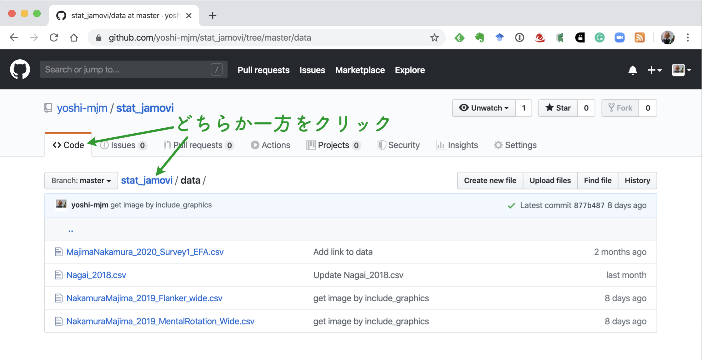
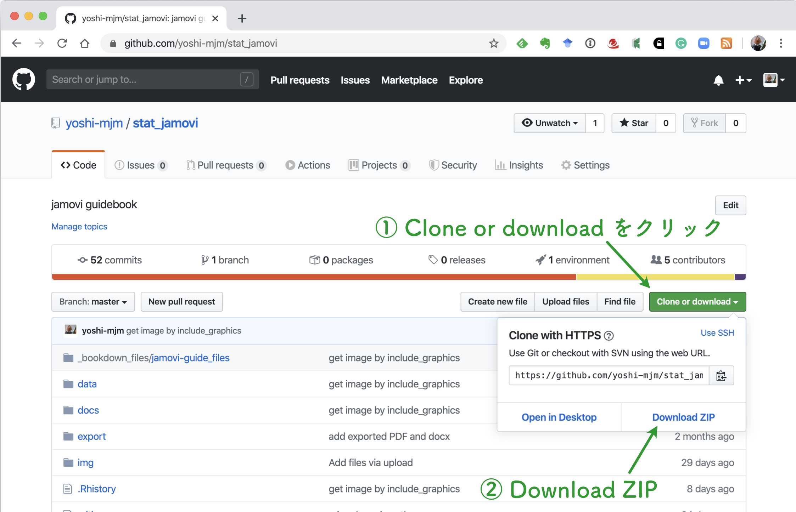

```{r setup, include=FALSE}
knitr::opts_chunk$set(echo = FALSE)
```

# このマニュアルについて

オープンソースの統計ソフトウェア jamovi (https://www.jamovi.org/) の北星学園大学版利用マニュアルです。
このマニュアルは，2019年度北星学園大学・特定研究費（共同研究費，課題名：学部・学科の垣根を越えた共通統計教育教材の開発，研究代表者：眞嶋良全）の費用援助を受けて作成されています。
まだまだ，修正中。

## 執筆者について

このマニュアルは，「学部・学科の垣根を越えた共通統計教育教材の開発」プロジェクトの成果として作成されています。
このプロジェクトは，北星学園大学・社会福祉学部の眞嶋良全を代表とし，同大文学部の石川悟，松浦年男，永井暁行，同大短期大学部の藤木晶子が参加して行われました。
プロジェクトメンバーの全員がこのマニュアルの執筆に参加しています。
なお，冒頭の著者名の表記は，執筆を担当した章の出現順序に沿っており，貢献度の多寡を示すものではありません。

## データについて

この教材で使用するデータは，[https://github.com/yoshi-mjm/stat_jamovi](https://github.com/yoshi-mjm/stat_jamovi){target="_blank"} の [data](https://github.com/yoshi-mjm/stat_jamovi/tree/master/data){target="_blank"} というフォルダの中にあります。また，これらのデータは，それぞれ，

- Majima, Y. & Nakamura, H. (2020). Development of the Japanese Version of the Generic Conspiracist Beliefs Scale (GCBS‐J). Japanese Psychological Research. [Advance Online Publication]. [https://doi.org/10.1111/jpr.12267](https://doi.org/10.1111/jpr.12267){target="_blank"}
- 永井暁行 (2018). ソーシャルスキルと態度による大学生の友人との付き合い方の分類―友人関係による居場所感の違い―. 教育心理学研究, 66, 54-66. [https://doi.org/10.5926/jjep.66.54](https://doi.org/10.5926/jjep.66.54){target="_blank"}
- 中村紘子・眞嶋良全(2019). 日本人クラウドワーカーによるオンライン実験と大学生による実験室実験における認知課題成績の比較. 基礎心理学研究, 38, 33-47. [https://doi.org/10.14947/psychono.38.10](https://doi.org/10.14947/psychono.38.10){target="_blank"}

を使用しています。
なお，Majima & Nakamura (2020) については，全てのデータが [https://osf.io/24w8u/](https://osf.io/24w8u/){target="_blank"}  からダウンロードすることが可能です。

## データのダウンロードについての補足

### リポジトリを一括ダウンロードする

上の [data](https://github.com/yoshi-mjm/stat_jamovi/tree/master/data){target="_blank"} というフォルダをクリックして表示されるファイルは，直接1つ1つのファイルをダウンロードできませんので注意してください。
このサイトは Git(Hub) を使ってバージョン管理をしているためです。
データをダウンロードする一番簡単な方法は，データも含めてサイトの全てを一括ダウンロードする方法です。
一括ダウンロードをするためには，上のリンクをクリックして data フォルダに移動し

```{r fig.cap="GitHub リポジトリ"}

```

図に示されるように <> Code と書かれているタブか，リポジトリの名前である stat_jamovi をクリックします。
リポジトリのトップに移動したら，

```{r fig.cap="Zip 形式でのダウンロード"}

```

右側にある緑色の Clone of download と書かれたボタンをクリックし，Download ZIP を選んでください。
リポジトリのファイルが一括で zip ファイルでダウンロードされます。
zip ファイルを展開した先に出来る data フォルダにデータが入っています。

```{r fig.cap="展開した先の data フォルダ"}
knitr::include_graphics('./img/00general/fig3_unzipped.png')
```

このガイドブックを授業で使用する場合は，授業担当者から別途指示があるかもしれませんので，その場合はその指示に従ってください。

### Git(Hub) を使う

Git というのは，プログラムのソースコードなどをバージョン管理するツールであり，[GitHub](https://github.com/){target="_blank"} は，Git を使った開発者を支援する Web サイトです。Git および GitHub の詳細はここでは省略しますが，[GitHub Desktop](https://help.github.com/ja/desktop){target="_blank"}というアプリケーションを使うと，リポジトリのコピー（クローン）なども簡単にできて便利です。

## その他の参考文献

jamovi の使い方については，下のサイトも参考になります。あわせてご覧ください。

- jamovi で学ぶ心理統計 [https://bookdown.org/sbtseiji/lswjamoviJ/](https://bookdown.org/sbtseiji/lswjamoviJ/){target="_blank"}